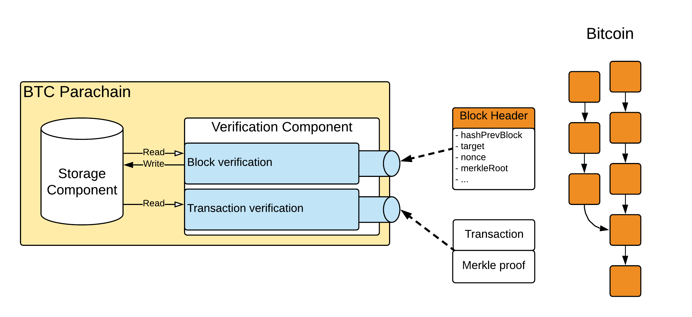

BTC-Relay Architecture
======================

BTC-Relay is a component / module of the BTC Parachain. 
Its main functionality is verification and storage of Bitcoin block headers, as well as verification of Bitcoin transaction inclusion proofs. 
Below, we provide an overview of its components, as well as relevant actors - offering references to the full specification contained in the rest of this document. 

    Overview of the BTC-Relay architecture. Bitcoin block headers are submitted to the Verification Component, which interacts with the Utils, Parser and Failure Handling components, as well as the Parachain Storage. 

Actors
~~~~~~~

BTC-Relay differentiates between the following actors:

* **Users** - BTC Parachain users which interact with the BTC-Relay directly or with other modules which make calls to BTC-Relay.

* **Staked Relayers** - staked relayers lock up collateral in the BTC Parachain and are responsible for running Bitcoin `full nodes <https://bitcoin.org/en/full-node>`_ and verify that blocks submitted to BTC-Relay are valid (and that transactional data for these blocks is available). Staked relayers can halt BTC-Relay in case a failure is detected. See :ref:`security` for more details. 

.. note:: While any user can submit block headers to BTC-Relay, this role can be assigned to staked relayers, given these participants already run Bitcoin full nodes and check validity of stored blocks.

* **(Parachain) Governance Mechanism** - the correct operation of the BTC Parachain, and hence of BTC-Relay, is overseen by the Parachain's governance mechanism (e.g. committee of consensus participants and other key actors of the BTC Parachain). 

.. note:: At the time of writing, the exact composition of the governance mechanism / commitee is not fully defined in Polkadot. This specification assumes the existence and correct operation of this mechanism - although modifications may be necessary to accomodate complexities and additional functional requirements, once the governance mechanism is fully specified.

Components
~~~~~~~~~~~

Storage
-------
 
This component stores the Bitcoin block headers and additional data structures, necessary for operating BTC-Relay, are persisted. See :ref:`data-model` for more details. 

Verification
------------

The Verification component offers functionality to verify Bitcoin block headers and transaction inclusion proofs. See :ref:`storage-verification` for the full function specification.

In more detail, the verification component performs the operations of a `Bitcoin SPV client <https://bitcoin.org/en/operating-modes-guide#simplified-payment-verification-spv>`_. See `this paper (Appendix D) <https://eprint.iacr.org/2018/643.pdf>`_ for a more detailed and formal discussion on the necessary functionality. 

* *Difficulty Adjustment* - check and keep track of Bitcoin's difficulty adjustment mechanism, so as to be able to determine when the PoW difficulty target needs to be recomputed.

* *PoW Verification* - check that, given a 80 byte Bitcoin block header and its block hash, (i) the block header is indeed the pre-image to the hash and (ii) the PoW hash matches the difficulty target specified in the block header.

* *Chain Verification* - check that the block header references an existing block already stored in BTC-Relay. 

* *Main Chain Detection / Fork Handling* - when given two conflicting Bitcoin chains, determine the *main chain*, i.e., the chain with the most accumulated PoW (longest chain in Bitcoin, though under consideration of the difficulty adjustment mechanism). 

* *Transaction Inclusion Verification* - given a transaction, a reference to a block header, the transaction's index in that block and a Merkle tree path, determine whether the transaction is indeed included in the specified block header (which in turn must be already verified and stored in the Bitcoin main chain tracked by BTC-Relay). 
 

An overview and explanation of the different classes of blockchain state verification in the context of cross-chain communication, specifically the difference between full validation of transactions and mere verification of their inclusion in the underlying blockchain, can be found `in this paper (Section 5) <https://eprint.iacr.org/2019/1128.pdf>`_.

Utils
-----

The Utils component provides "helper" functions used by the Storage and Verification components, such as the calculation of Bitcoin's double SHA256 hash, or re-construction of Merkle trees. See :ref:`utils` for the full function specification.

Parser
------

The Parser component offers functions to parse Bitcoin's block and transaction data structures, e.g. extracting the Merkle tree root from a block header or the OP_RETURN field from a transaction output. See :ref:`parser` for the full function specification.

Failure Handling
-----------------

BTC-Relay interacts with the Failure Handling component of the BTC Parachain: since failures of BTC-Relay impact the entire operation of the BTC Parachain, the Failure Handling components tracks and reacts to changes in BTC-Relay's operation. 

Specifically, Staked Relayers and the Governance Mechanism can restrict or entirely halt the operation of BTC-Relay, which in turn affects the available functionality of the entire BTC Parachain. 
See Failure Handling section of the PolkaBTC specification document for a full specification of failure handling on the BTC Parachain, and the interactions with BTC-Relay. 
On a high level, BTC-Relay can enter four possible states:

* ``RUNNING``: correct operation, all functions are available. 

* ``PARTIAL``: transaction verification is disabled for blocks above a specified block height. This state is triggered by a ``NO_DATA_BTC_RELAY`` failure by Staked Relayers (missing transaction data for submitted block headers), or manually by the Governance Mechanism. 

* ``HALTED``: transaction verification is entirely disabled. This state is triggered by a ``INVALID_BTC_RELAY`` failure by Staked Relayers (invalid transaction was detected in a submitted block header) or manually by the Governance Mechanism.

* ``SHUTDOWN``: submission of block headers (both main chain and forks) and transactions verification are disabled. This state can be triggered manually by the Governance Mechanism if a major failure is detected or a soft / hard fork has ocurred in Bitcoin (and hence BTC-Relay needs updating). 

A full state machine, explaining how BTC-Relay transitions between different states, is provided in the Failure Handling section of the PolkaBTC specification.

.. todo:: Links to the PolkaBTC specification will be included once the documents are merged.

