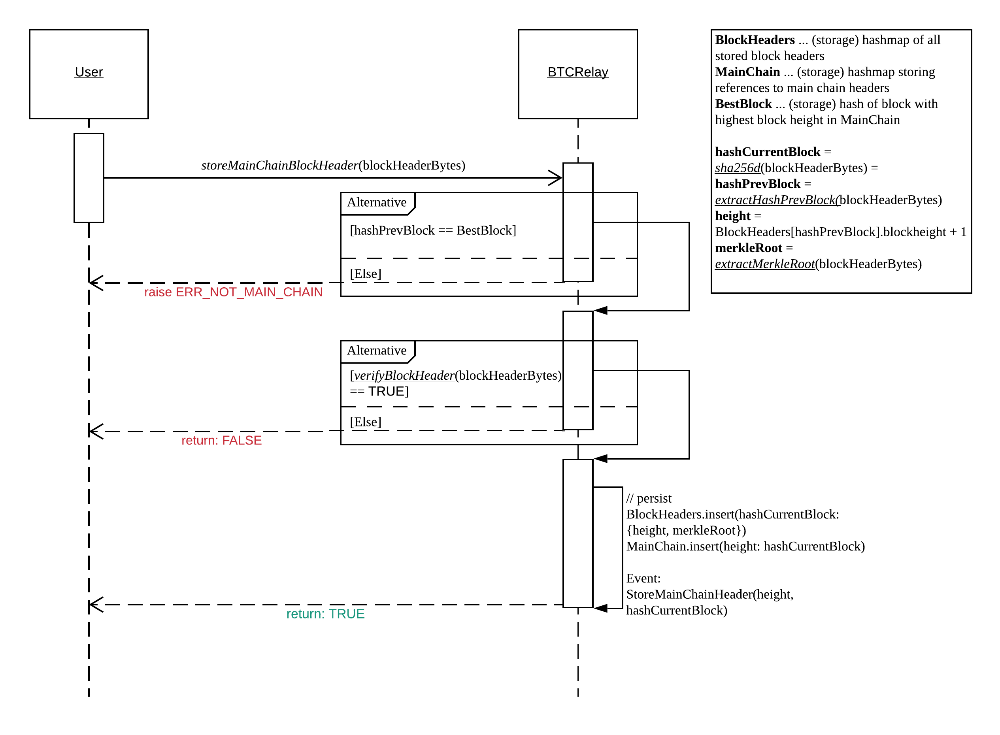
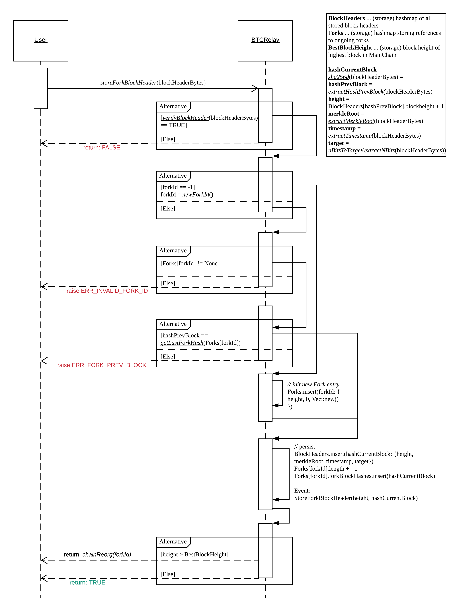
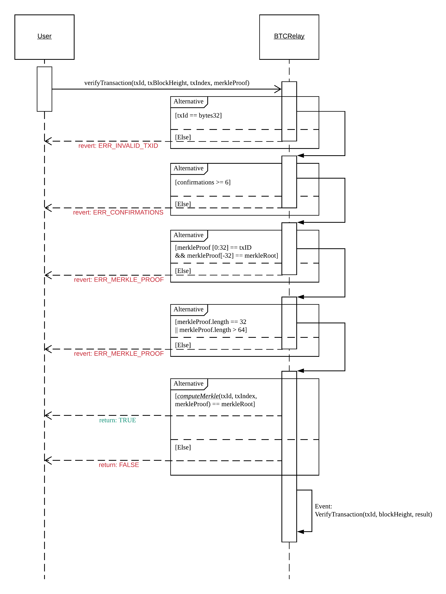

Storage and Verification
================================

.. _initialize:

initialize
----------
Initializes BTC-Relay with the first Bitcoin block to be tracked and Initializes all data structures (see `Data Model <spec/data-model.html#data-model>`_).

.. note:: BTC-Relay **does not** have to be initialized with Bitcoin's genesis block! The first block to be tracked can be selected freely. 

.. warning:: Caution when setting the first block in BTC-Relay: only succeeding blocks can be submitted and **predecessors will be rejected**!

Specification
~~~~~~~~~~~~~~

*Function Signature*

``initialize(blockHeaderBytes, blockHeight)``

*Parameters*

* ``blockHeaderBytes``: raw Bitcoin block header bytes (80 bytes).
* ``blockHeight``: Bitcoin block height of the submitted block header 

*Returns*

* ``True``: if initialization is executed correctly (and for the first time only)
* ``False`` (or throws exception): otherwise.

*Events*

* ``StoreMainChainHeader(blockHeight, blockHash)``: if the block header was stored successfully, emit an event with the stored block's height (``blockHeight``) and the (PoW) block hash (``blockHash``).

*Errors*

* ``ERR_ALREADY_INITIALIZED``: "Already initialized.": raise exception if this function is called when BTC-Relay is already initialized.

*Substrate*

* ``fn initialize(origin, blockHeaderBytes: T::BTCBlockHeader, blockHeight: U256) -> Result {...}``

User Story
~~~~~~~~~~
This function is only called once, when BTC-Relay is being deployed. 

.. note:: Calls to ``initialize`` will likely be restricted through the governance mechanism of the BTC-Parachain. This is to be defined.  

Function sequence
~~~~~~~~~~~~~~~~~

The ``initialize`` function takes as input the 80 byte raw Bitcoin block header and the corresponding Bitcoin block height follows the following sequence:

1. Check if ``initialize`` is called for the first time. This can be done by checking if ``BestBlock == None``. Raise ``ERR_ALREADY_INITIALIZED`` if BTC-Relay has already been initialized. 

2. Parse ``blockHeaderBytes``, extracting the ``merkleRoot`` using ``extractMerkleRoot(blockHeaderBytes)``, and store the block header data in ``BlockHeaders``. 

3. Compute the Bitcoin block hash (``hashCurrentBlock``) of the block header (use ``sha256d(blockHeaderBytes)``) and store it as an entry in ``MainChain`` using the provided ``blockHeight`` as key. 

4. Set ``BestBlock = hashCurrentBlock`` and ``BestBlockHeight = blockHeight``.

5. Return ``True``. 

.. warning:: Attention: the Bitcoin block header submitted to ``initialize`` must be in the Bitcoin main chain - this must be checked outside of the BTC-Parachain **before** making this function call! A wrong initialization will cause the entire BTC-Parachain to fail, since verification requires that all submitted blocks **must** (indirectly) point to the initialized block (i.e., have it as ancestor, just like the actual Bitcoin genesis block).

.. _storeMainChainBlockHeader:

storeMainChainBlockHeader
-------------------------
Method to submit block headers to the BTC-Relay, which extend the Bitcoin main chain (as tracked in ``MainChain`` in the BTC-Relay). 
This function calls the ``verifyBlockHeader`` proving the 80 bytes Bitcoin block header as input, and, if the latter returns ``True``, extracts from the block header and stores (i) the hash, height and Merkle Tree root of the given block header in ``BlockHeaders`` and (ii) the hash and block height in ``MainChain``.

Specification
~~~~~~~~~~~~~

*Function Signature*

``storeMainChainBlockHeader(blockHeaderBytes)``

*Parameters*

* ``blockHeaderBytes``: raw Bitcoin block header bytes (80 bytes).

*Returns*

* ``True``: if ``verifyBlockHeader`` returns ``True`` and the extraction and storage of the block header data was executed correctly. 
* ``False`` (or throws exception): otherwise.

*Events*

* ``StoreMainChainHeader(blockHeight, blockHash)``: if the block header was stored successfully, emit an event with the stored block's height (``blockHeight``) and the (PoW) block hash (``blockHash``).

*Errors*

* ``ERR_NOT_MAIN_CHAIN`` = "Main chain submission indicated, but submitted block is on a fork": raise exception if the block header submission indicates that it is extending the current longest chain, but is actually on a (new) fork.

*Substrate*

* ``fn storeMainChainBlockHeader(origin, blockHeaderBytes: T::BTCBlockHeader) -> Result {...}``

User Story
~~~~~~~~~~

A user calls the ``storeMainChainBlockHeader`` function when submitting a new Bitcoin block header to the BTC-Relay. 
Thereby, the user performes the following steps:

1. The user checks that the to-be-submitted Bitcoin block header in part of the longest (main) chain *tracked by the BTC-Relay*. 

.. warning:: The BTC-Relay does not necessarily have the same view of the Bitcoin blockchain as the user's local Bitcoin client. This can happen if (i) the BTC-Relay is under attack (see `Relay Poisoning <TODO>`_), (ii) the BTC-Relay is out of sync (see `Relay Freshness <TODO>`_), or, similarly, (iii) if the user's local Bitcoin client is under attack or out of sync. 

2. The user calls the function passing an 80 byte block header (``blockHeaderBytes``) and receives one of two possible results:

    a. ``True``: the block header was successfully verified and stored.
    b. ``False``: if verification fails (see exceptions raised for reason).

.. note:: The 80 bytes block header can be retrieved from the `bitcoin-rpc client <https://en.bitcoin.it/wiki/Original_Bitcoin_client/API_calls_list>`_ by calling the `getBlock <https://bitcoin-rpc.github.io/en/doc/0.17.99/rpc/blockchain/getblock/>`_ and settign verbosity to ``0`` (``getBlock <blockHash> 0``).

Function sequence
~~~~~~~~~~~~~~~~~

The ``storeMainChainBlockHeader`` function takes as input the 80 byte raw Bitcoin block header and follows the following sequence:

1. Check that the submitted block header is extending the ``MainChain`` of BTC-Relay. That is, ``hashPrevBlock`` (extract using ``extractHashPrevBlock(blockHeaderBytes)``) must be equal to ``BestBlock``. 

    a. Raise ``ERR_NOT_MAIN_CHAIN`` error if this check fails.

2. Call ``verifyTransaction(blockHeaderBytes)``. 

    a. If this call **does not return** ``True`` (i.e., fails or returns ``False``), then abort and return ``False``. 

3. Store the ``height`` and ``merkleRoot`` of the block header in the ``blockHeaders`` map, using ``hashCurrentBlock`` as key.

    + ``hashCurrentBlock`` is the double SHA256 hash over the 80 bytes block header and can be calculated by calling ``sha256d(blockHeaderBytes)``.
    + ``merkleRoot`` is the root of the transaction Merkle Tree of the block header. Use ``extractMerkleRoot(blockHeaderBytes)`` to extract from block header. 
    + ``height`` is the blockchain height of the submitted block header. Compute by incrementing the height of the block header referenced by ``hashPrevBlock`` (retrieve from ``BlockHeaders`` using ``hashPrevBlock`` as key).

3. Emit a ``StoreMainChainBlockHeader`` event using ``height`` and ``hashCurrentBlock`` as input (``StoreMainChainHeader(height, hashCurrentBlock)``). 

4. Return ``True``.
 

    Sequence diagram showing the function sequence of ``storeMainChainBlockHeader``.

.. _storeForkBlockHeader:

storeForkBlockHeader
--------------------
Method to submit block headers to the BTC-Relay, which extend an existing of create a new *fork* (as tracked in ``Forks`` in the BTC-Relay). 
This function calls the ``verifyBlockHeader`` proving the 80 bytes Bitcoin block header as input, and, if the latter returns ``True``, extracts from the block header and stores (i) the hash, height and Merkle Tree root of the given block header in ``BlockHeaders`` and (ii) the hash of the block header as well as the starting block height of the fork and the current lenght (1 if a new fork) in ``forks``.

Specification
~~~~~~~~~~~~~~

*Function Signature*

``storeForkHeader(blockHeaderBytes, forkId)``

*Parameters*

* ``blockHeaderBytes``: raw Bitcoin block header bytes (80 bytes).
* ``forkId``: if block header is on a fork, specifies which fork is being extended (or being newly created).

*Returns*

* ``True``: if the block header passes all checks and extends new or extends an existing fork of the currenlty known longest chain
* ``False``: otherwise.

*Events*

* ``StoreForkHeader(forkId, blockHeight, blockHash)``: if the submitted block header is on a fork, emit an event with the fork's id (``forkId``), block height (``blockHeight``) and the (PoW) block hash (``blockHash``).
*  ``ChainReorg(newChainTip, startHeight, forkId)``: if the submitted block header on a fork results in a reorganization (fork longer than current main chain), emit an event with the block hash of the new highest block (``newChainTip``), the start block height of the fork (``startHeight``) and the fork identifier (``forkId``).

*Errors*

* ``ERR_FORK_PREV_BLOCK`` = "Previous block hash does not match last block in fork submission": raise exception if the block header does not reference the heighest block in the fork specified by ``forkId`` (via ``prevBlockHash``). 
* ``ERR_NOT_FORK`` = "Indicated fork submission, but block is in main chain":  raise exception if the block header creates a new or extends an existing fork, but is actually extending the current longest chain.

*Substrate*

* ``fn storeForkBlockHeader(origin, blockHeaderBytes: T::BTCBlockHeader, forkId: U256) -> Result {...}``

User Story
~~~~~~~~~~

A user calls the ``storeForkBlockHeader`` function when submitting a new Bitcoin block header, which is not extending the tip of the ``MainChain`` tracked in BTC-Relay. 
Thereby, the user performes the following steps (see notes and warnings in ``storeMainChainBlockHeader``):

1. The user checks that the to-be-submitted Bitcoin block header in **not part** of the longest (main) chain *tracked by the BTC-Relay*. 

2. If the block header is on an existing *fork tracked by the BTC-Relay*, the user looks up the ``forkId`` in ``Forks`` in the BTC-Relay. If it is a new fork, specify ``-1`` as ``forkId`` (or other pre-defined value) - BTC-Relay will then create a new entry in ``Forks`` and assign a new ``forkId`` when storing the block header.

3. The user calls the function passing an 80 byte block header (``blockHeaderBytes``) and receives one of two possible results:

    a. ``True``: the block header was successfully verified and stored as a fork.
    b. ``False``: if verification fails (see exceptions raised for reason).

.. Use Cases
~~~~~~~~~~~~
**Detection and Tracking of Forks**:
Blockchain reorganizations or forks which occur on Bitcoin are detected and set up for tracking when a block header is submitted whose block height is lower than the currently tracked main chain height.

Function Sequence
~~~~~~~~~~~~~~~~~

The ``storeForkBlockHeader`` function takes as input the 80 byte raw Bitcoin block header and a ``forkId`` and follows the following sequence:

1.  Call ``verifyTransaction(blockHeaderBytes)``. 

    a. If this call **does not return** ``True`` (i.e., fails or returns ``False``), then abort and return ``False``. 

2. Check if ``forkId == -1``.

    a. If ``forkId == -1``, generate a new ``forkId`` and create a new entry in ``Forks``, setting the ``heigh`` of the block header as the ``startHeight`` of the fork.
    
    b. Otherwise:

        b.1 Check if a fork is tracked in ``Forks`` under the specified ``forkId``. If no fork can be found, raise an ``ERR_INVALID_FORK_ID`` exception and abort. 

        b.2 Check that the ``hashPrevBlock`` of the submitted block header indeed references the last block submitted to the fork specified by ``forkId`` (use ``getLastForkHash(forkId)``). Raise ``ERR_FORK_PREV_BLOCK`` exception and abort if this check fails.

3. Store the ``height`` and ``merkleRoot`` of the block header in the ``blockHeaders`` map, using ``hashCurrentBlock`` as key.

4. Update ``Fork[forkId]`` entry, incrementing the fork ``length`` and inserting ``hashCurrentBlock`` into the list of block hashes contained in that fork (``forkBlockHashes``).  

5. Emit a ``StoreForkBlockHeader`` event using ``height`` and ``hashCurrentBlock`` as input (``StoreMainChainHeader(height, hashCurrentBlock)``). 

6. Check if the fork at ``forkId`` has become longer than the current ``MainChain``. This is the case if the block height ``height`` of the submitted block header exceeds the ``BestBlockHeight``. 

    a. If ``height > BestBlockHeight`` call ``chainReorg(forkId)`` and return the value returned form this call.
    b. Otherwise return ``True``.

4. Return ``True``.

    Sequence diagram showing the function sequence of ``storeForkBlockHeader``.

.. _verifyBlockHeader:

verifyBlockHeader
-----------------

The ``verifyBlockHeader`` function parses and verifies Bitcoin block
headers. 

.. Warning:: This function must called and return ``True`` **before**  a Bitcoin block header is stored in the BTC-Relay (i.e., must be called by the ``storeMainChainBlockHeader`` and ``storeForkBlockHeader`` functions).

.. note:: This function does not check whether the submitted block header extends the main chain or a fork. This check is performed in ``storeMainChainBlockHeader`` and ``storeForkBlockHeader`` respectively.

Other operations, such as verification of transaction inclusion, can only be executed once a block header has been verified and conseauently stored in the BTC-Relay. 

Specification
~~~~~~~~~~~~~~
*Function Signature*

``verifyBlockHeader(blockHeaderBytes)``

*Parameters*

* ``blockHeaderBytes``: raw Bitcoin block header bytes (80 bytes).

*Returns*

* ``True``: if the block header passes all checks.
* ``False`` (or throws exception): otherwise.

*Errors*

* ``ERR_INVALID_FORK_ID`` = "Incorrect fork identifier.": raise an exception when a non-existent fork identifiert or ``0`` (blocked for special meaning) is passed. 
* ``ERR_INVALID_HEADER_SIZE`` = "Invalid block header size": raise exception if the submitted block header is not exactly 80 bytes long.
* ``ERR_DUPLICATE_BLOCK`` = "Block already stored": raise exception if the submitted block header is already stored in the BTC-Relay (same PoW ``blockHash``). 
* ``ERR_PREV_BLOCK`` = "Previous block hash not found": raise an exception if the submitted block does not reference an already stored block header as predecessor (via ``prevBlockHash``). 
* ``ERR_LOW_DIFF`` = "PoW hash does not meet difficulty target of header": raise exception when the header's ``blockHash`` does not meet the ``target`` specified in the block header.
* ``ERR_DIFF_TARGET_HEADER`` = "Incorrect difficulty target specified in block header": raise exception if the ``target`` specified in the block header is incorrect for its block height (difficulty re-target not executed).

*Substrate*

* ``fn verifyBlockHeader(origin, blockHeaderBytes: T::BTCBlockHeader) -> Result {...}``

User Story
~~~~~~~~~~
This function is called from both ``storeMainChainBlockHeader`` and ``storeForkBlockHeader``, but (typically) not by the user directly.
Optionally, a user can call this function and submit an 80 byte Bitcoin block header. 

The caller of this function receives as return value:

    a. ``True``: the block header was successfully verified 
    b. ``False`` (or an exceptin is raised): if verification fails

.. Use Cases
~~~~~~~~~
**Verification of Transaction Inclusion**:
To be able to verify that a transaction is included in the Bitcoin blockchain, the corresponding block at the specified ``txBlockHeight`` must be first submitted, verified and stored in the BTC-Relay via ``verifyBlockHeader``. 

Function Sequence
~~~~~~~~~~~~~~~~~
The ``verifyBlockHeader`` function takes as input the 80 byte raw Bitcoin block header and follows the following sequence:

1. Check that the ``blockHeaderBytes`` are 80 bytes long. Raise ``ERR_INVALID_HEADER_SIZE`` exception and abort otherwise.
2. Check that the block header is not yet stored in the BTC-Relay (``blockHash`` is unique in ``blockHeaders``). Raise ``ERR_DUPLICATE_BLOCK`` exception and abort otherwise. 
3. Check that the previous block referenced by the submitted block header (``hashPrevBlock``) exists in ``BlockHeaders``. Raise ``ERR_PREV_BLOCK`` exception adn abort otherwise. 
4. Check that the Proof-of-Work hash (``blockHash``) is below the ``target`` specified in the block header. Raise ``ERR_LOW_DIFF`` exception and abort otherwise.
5. Check that the ``target`` specified in the block header is correct by calling ``correctTarget(hashPrevBlock, height, target)`` (as per Bitcoin's difficulty adustment mechanism, see `here <https://github.com/bitcoin/bitcoin/blob/78dae8caccd82cfbfd76557f1fb7d7557c7b5edb/src/pow.cpp>`_). If this call returns ``False``, raise ``ERR_DIFF_TARGET_HEADER`` exception and abort. 
6. Return ``True``

.. figure:: ../figures/verifyBlockHeader-sequence.png
    :alt: verifyBlockHeader sequence diagram

    Sequence diagram showing the function sequence of ``verifyBlockHeader``.

.. _verifyTransaction:

verifyTransaction
-----------------

The ``verifyTransaction`` function is one of the core components of the BTC-Relay:
this function returns whether a given transaction is valid by considering a number of parameters.
The core idea is that a user submits a transaction hash including the parameters to proof to another party that  the transaction is included in the Bitcoin blockchain.
Since the verification is based on the data in the BTC-Relay, other parties can rely on the trustworthiness of such a proof.

Specification
~~~~~~~~~~~~~

*Function Signature*

``verifyTransaction(txId, txBlockHeight, txIndex, merkleProof)``

*Parameters*

* ``txId``: the hash of the transaction.
* ``txBlockHeight``: block height at which transaction is supposedly included.
* ``txIndex``: index of transaction in the block's tx Merkle tree.
* ``merkleProof``: Merkle tree path (concatenated LE sha256 hashes).

*Returns*

* ``True``: if txId is at the claimed position in the block at the given txBlockHeight.
* ``False``: otherwise.

*Events*

* ``VerifyTransaction(txId, txBlockHeight, result)``: issue an event for a given txId and a blockHeight and return the result of the verification (either ``True`` or ``False``).

*Errors*

* ``ERR_INVALID_TXID = "Invalid transaction identifier"``: raise an exception when the transaction id (``txId``) is malformed.
* ``ERR_CONFIRMATIONS = "Transaction has less confirmations than requested"``: raise an exception when the number of confirmations is less than required.
* ``ERR_MERKLE_PROOF = "Invalid Merkle Proof structure"``: raise an exception when the Merkle proof is malformed.

*Substrate*

* ``fn verifyTransaction(origin, txId: T::Hash, txBlockHeight: U256, txIndex: u64, merkleProof: String) -> Result {...}``

User Story
~~~~~~~~~~

Generally, a user has to follow four steps to successfully verify a transaction:

1. The user ensures that the Bitcoin block header, in which his transaction is included, is stored in the BTCRelay (see `verifyBlockHeader`_).
2. The user ensures that the block has the minimum number of required confirmations (typically ``6``).
3. The user prepares the necessary input parameters from the Bitcoin blockchain to call the ``verifyTransaction`` function. The user can receive these parameters from the `bitcoin-rpc client <https://en.bitcoin.it/wiki/Original_Bitcoin_client/API_calls_list>`_.

    a. The *transaction hash* is the transaction that should be verified. The user should note the transaction hash when sending a Bitcoin transaction he wants to verify.
    b. The *block height* refers to the block in which the transaction is included. The user receives the block height from the `getrawtransaction <https://bitcoin-rpc.github.io/en/doc/0.17.99/rpc/rawtransactions/getrawtransaction/>`_ ``bitcoin-rpc`` method by querying for his transaction hash and receiving the ``blockindex``.
    c. The *transaction index* specifies the index of the transaction in the block. The user receives the index from the ``bitcoin-rpc`` method `getblock <https://bitcoin-rpc.github.io/en/doc/0.17.99/rpc/blockchain/getblock/>`_ by geting the index from the ``tx`` array storing the all transaction hashes in that block.
    d. The *Merkle proof* encodes how to calculate the Merkle root from the transaction hash. The user receives the proof from the ``bitcoin-rpc`` method `gettxoutproof <https://bitcoin-rpc.github.io/en/doc/0.17.99/rpc/blockchain/gettxoutproof/>`_.

4. The user submits the above parameters to the ``verifyTransaction`` function and receives one of two possible results.

    a. ``True``: the transaction is successfully verified.
    b. ``False``: the transaction cannot be verified given the input parameters provided by the user.

.. Use Cases
~~~~~~~~~
**Issue of Bitcoin-backed Assets**: Users can create Bitcoin-backed tokens on Polkadot by proving to the Polkadot blockchain that they have sent a number of Satoshis to a vault's Bitcoin address. To realize this, a user acts as a so-called CbA Requester. First the CbA-Requester transfers the Satoshis to the Bitcoin address of a Vault on the Bitcoin blockchain. The CbA-Requester notes the transaction hash of this transaction. Next, the CbA-Requester proves to the Polka-BTC bridge that the vault has received his Satoshis. He achieves this by ensuring that the block header of his transaction is included in the BTCRelay and has enough confirmations. He then extracts the input parameters as described in step 3 of the `User Story`_ above. With these input parameters he calls the ``verifyTransaction`` to receive a successful transaction inclusion proof.

Function Sequence
~~~~~~~~~~~~~~~~~

The ``verifyTransaction`` function takes four inputs and follows the following sequence to verify if a transaction is valid:

1. The *transaction hash* (``txId``) needs to be 32 bytes long. If this condition is not met, the ``ERR_INVALID_TXID`` error is raised.
2. The submitted *block height* (``txBlockHeight``) is stored in BTCRelay and the block in which the transaction is included has enough confirmations. This check ensures that the submitted *block height* has at least the required amount of previous blocks (default ``6``). Raises ``ERR_CONFIRMATIONS`` if the condition is not met. 
3. The user submitted a valid *Merkle proof*. The Merkle proof needs to contain the *transaction hash* in its first 32 bytes. Further, the last hash in the Merkle proof must be the block header hash in which the transaction is included. If this condition is not met, the function raises an ``ERR_MERKLE_PROOF`` error.
4. The *Merkle proof* must be either 32 bytes long if the block contains only the coinbase transaction, or be above 64 bytes if the block contains more than one transaction. If this condition is not met, the function raises an ``ERR_MERKLE_PROOF`` error.
5. Last, the function calls the ``computeMerkle`` helper function to calculate the Merkle root. If ``computeMerkle`` returns the merkleRoot, the function returns ``True``, otherwise ``False``. On completion of the function the ``VerifyTransaction`` event is generated including the transaction hash (``txId``), the block height (``txBlockHeight``), and the result (either ``True`` or ``False``).

    The steps to verify a transaction in the ``verifyTransaction`` function.

