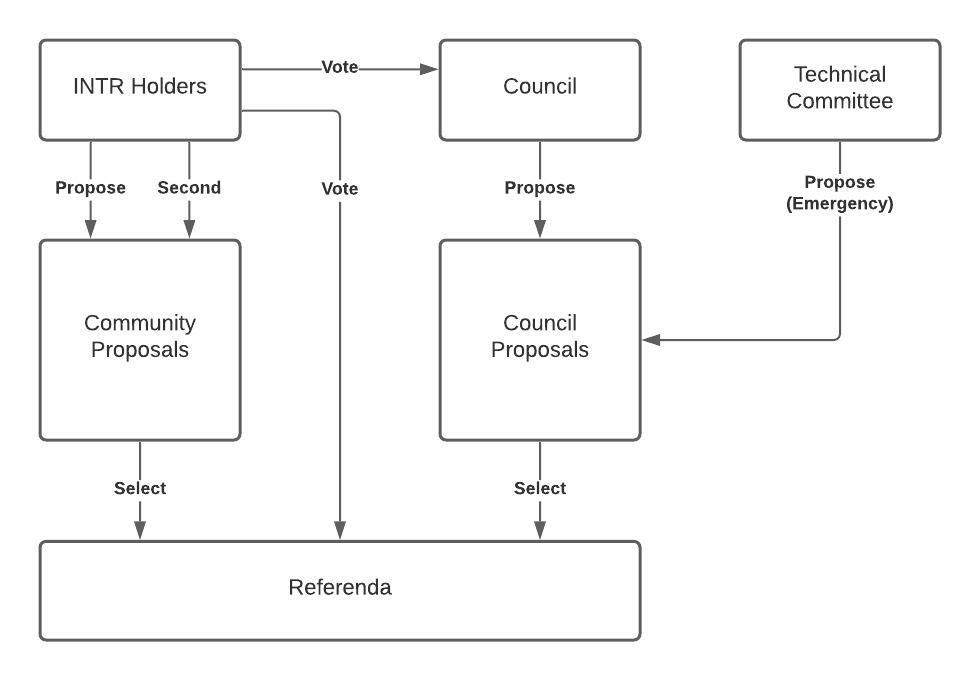

.. _democracy_module:

Democracy
=========

Overview
~~~~~~~~

On-chain governance is useful for controlling system parameters, authorizing trusted oracles and upgrading the core protocols. The architecture adopted by interBTC is modelled on Polkadot with some significant changes:

- **Optimistic Governance**
    - No **Council**, only public proposals from community
    - Community can elect a **Technical Committee** to fast-track proposals
    - Referenda are Super-Majority Against (Negative Turnout Bias) by default

- **Stake-To-Vote** (:ref:`escrow_module`)
    - Adopted from Curve's governance model
    - Users lock the native governance token
    - Longer lockups give more voting power

An important distinction is the ``negative turnout bias`` (Super-Majority Against) voting threshold. This is best summarized by the `Polkadot <https://wiki.polkadot.network/docs/learn-governance>`_ docs:

A heavy super-majority of nay votes is required to reject at low turnouts, but as turnout increases towards 100%, it becomes a simple majority-carries as below.

.. math:: \frac{\text{against}}{\sqrt{\text{electorate}}} < \frac{\text{approve}}{\sqrt{\text{turnout}}}

Terminology
~~~~~~~~~~~

- **Proposals** are community-supported motions to perform system-level actions.
- **Referenda** are accepted proposals undergoing voting.

.. Processes
.. ~~~~~~~~~

.. Proposals
.. ---------

.. 1. Account submits public proposal with deposit (``> MinimumDeposit``)
.. 2. Account "seconds" proposal with additional deposit
.. 3. New referenda are started every ``LaunchPeriod``
.. 4. Community can vote on referenda for the ``VotingPeriod``
.. 5. Votes are tallied after ``VotingPeriod`` expires
.. 6. System update executed after ``EnactmentPeriod``

.. Technical Committee
.. -------------------

.. 1. Community creates proposal as above
.. 2. TC may fast track before ``LaunchPeriod``
.. 3. The new referendum is started immediately
.. 4. Community can vote on referenda for the ``FastTrackVotingPeriod``

Data Model
~~~~~~~~~~

Constants
---------

.. _democracy_constant_minimum_deposit:

MinimumDeposit
..............

The locktime is rounded to weeks to limit checkpoint iteration.

.. _democracy_constant_max_proposals:

MaxProposals
............

The maximum number of proposals allowed in the queue.

Scalars
-------

.. _democracy_scalar_public_prop_count:

PublicPropCount
...............

Stores the number of public proposals created so far.

.. _democracy_scalar_public_props:

PublicProps
...........

Stores an array of the tuple ``(index, proposal_hash, who)``.

Maps
----

.. _democracy_map_deposit_of:

DepositOf
.........

Stores the accounts and deposits backing a proposal by ``prop_index``.

External Functions
~~~~~~~~~~~~~~~~~~

.. _democracy_function_propose:

propose
-------

Create a proposal for some system-level upgrade.

Specification
.............

*Function Signature*

``propose(who, proposal_hash, value)``

*Parameters*

* ``who``: The user's address.
* ``proposal_hash``: The hash of the proposal preimage.
* ``value``: The amount of deposit.

*Events*

* :ref:`democracy_event_proposed`

*Preconditions*

* The function call MUST be signed by ``who``.
* The ``amount`` MUST be greater than the :ref:`democracy_constant_minimum_deposit`.
* The number of public proposals MUST NOT exceed :ref:`democracy_constant_max_proposals`.

*Postconditions*

* :ref:`democracy_scalar_public_prop_count` MUST increase by one.
* The deposit MUST be recorded in :ref:`democracy_map_deposit_of`.
* A new proposal MUST be appended to :ref:`democracy_scalar_public_props` WHERE:

    * ``who`` is the proposer.
    * ``proposal_hash`` is the hash of the proposal.
    * ``index`` is the :ref:`democracy_scalar_public_prop_count` before increment.

Events
~~~~~~

.. _democracy_event_proposed:

Proposed
--------

Emit an event if a new proposal was created.

*Event Signature*

``Proposed(proposal_index, deposit)``

*Parameters*

* ``proposal_index``: The index of a proposal in the queue.
* ``deposit``: The initial bond places for deposit.

*Functions*

* :ref:`democracy_function_propose`
