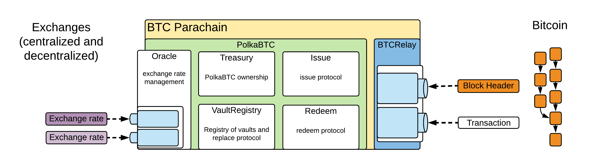
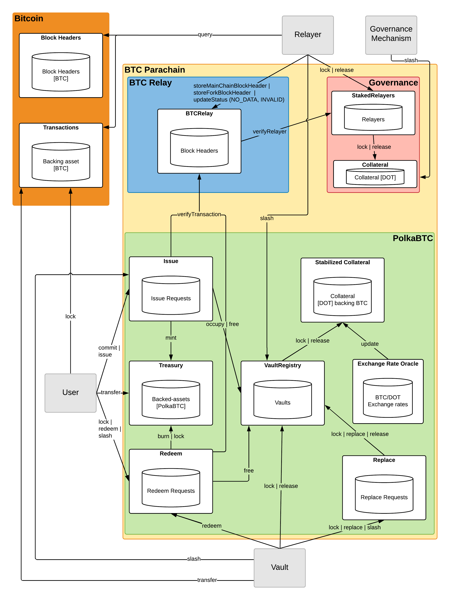

Architecture
============

The PolkaBTC implementation consists of five different actors, seven modules, and is integrated with the BTC-Relay module and the Parachain Governance mechanism.

Actors
~~~~~~

There are four main participant roles in the system. A detailed overview of all components and actors, as well as interactions between them, is provided in the `Figure </intro/architecture.html#id5>`_ below.

- **Vaults**: Collateralized intermediaries on backing blockchain (Bitcoin), which provide collareral in DOT on the BTC Parachain and receive and hold BTC from users who wish to create PolkaBTC tokens. When a user destroys PolkaBTC tokens, a Vault releases the corresponding amount of BTC to the user's BTC address. Vaults interact with the following components: *VaultRegistry*, *Redeem*, *Replace*
- **Users**: Users interacting with the BTC Parachain in order to create, use (trade/transfer/...), and redeem Bitcoin-backed PolkaBTC tokens. Since the different protocol phases can be executed by different users, we íntroduce the following *sub-roles*:

  - **Requester**: A user that locks BTC with a Vault on Bitcoin and issues PolkaBTC on the BTC Parachain. Interacts with the *Issue* component.
  - **Sender**: A user that sends PolkaBTC to a Receiver on the BTC Parachain. Interacts with the *Treasury* component. 
  - **Receiver**: A user that receives PolkaBTC on the BTC Parachain. Interacts with the *Treasury* component. 
  - **Redeemer**: A user that destroys PolkaBTC on the BTC Parachain to receive the corresponding amount of BTC on the Bitcoin blockchain from a Vault. Interacts with the *Redeem* component. 
- **Staked Relayers**:  Collateralized intermediaries which run Bitcoin full nodes and (i) monitor validity and availability of transactional data for Bitcoin blocks submitted to BTC-Relay, (ii) monitor that Vaults do not move locked BTC on Bitcoin without prior authorization by the BTC Parachain (i.e., through one of the Issue, Redeem or Replace protocols). In case either of the above errors was detected, Staked Relayers report this to the BTC Parachain. Interact with the *BTC-Relay*, *StakedRelayers*, and *VaultRegistry* components. 

.. todo:: The exact composition of Staked Relayers (static vs dynamic committee) and the internal agreement mechanism needs to be defined. Do Staked Relayers run a BFT protocol to create a threshold signature when reporting an error / updating the state of BTC-Relay? Who can join this committee?

- **Governance Mechanism**: The Parachain Governance Mechanism monitors the correct operation of the BTC Parachain, as well as the correct behaviour of Staked Relayers (and other participants if necessary). Interacts with the *RelayerCollateral* component when Staked Relayers misbehave and can manually interfere with the operation and parameterization of all components of the BTC Parachain.

.. note:: The exact composition of the Governance Mechanism is to be defined by Polkadot.  

Modules
~~~~~~~

The seven modules in PolkaBTC interact with each other, but all have distinct logical functionalities. The figure below shows them.

The specification clearly separates these modules to ensure that each module can be implemented, tested, and verified in isolation. The specification follows the principle of abstracting the internal implementation away and providing a clear interface. This should allow optimisation and improvements of a module with minimal impact on other modules.

    High level overview of the BTC Parachain. PolkaBTC consists of seven modules. The Oracle module stores the exchange rates based on the input of centralized and decentralized exchanges. The Treasury module maintains the ownership of PolkaBTC, the VaultRegistry module stores information about the current Vaults in the system, and the Issue, Redeem and Replace modules expose funcitons and maintain data related to the respective sub protocols. The StabilizedCollateral modules handles Vault collateralization, stabilization against exchange rate fluctuations and automatic liquidation. BTC-Relay tracks the Bitcoin main chain and verifies transaction inclusion. The Parachain Governance maintains correct operation of the BTC Parachain and intervenes / halts operation if necessary. 

ExchangeRateOracle
------

The Oracle module maintains the ``ExchangeRate`` value between the asset that is used to collateralize Vaults (DOT) and the to-be-issued asset (BTC).
In the proof-of-concept the Oracle is operated by a trusted third party to feed the current exchange rates into the system.

.. note:: The exchange rate oracle implementation is not part of this specification. PolkaBTC simply expects a continuous input of exchange rate data and assumes the oracle operates correctly.
.. .. todo:: Check with Web3 on how they plan to implement this. Probably, Governance Mechanism will provide this service, or intervene in case of failures.

Treasury
--------

The Treasury module maintains the ownership and balance of PolkaBTC token holders. It allows respective owners of PolkaBTC to send their tokens to other entities via the :ref:`Transfer protocol <transfer-protocol>` and to query their balance.
Further, it tracks the total supply of tokens.

VaultRegistry
-------------

The VaultRegistry module manages the Vaults in the system, exposing functionality for:

* Managing the list of active Vaults in the system and the necessary data (e.g. BTC addresses) to execute the Issue, Redeem and Replace protocols.

This module also handles the collateralization rates of Vaults and reacts to exchange rate fluctuations.
Specifically, it 

* stores how much collateral each Vault provided and how much of that collateral is allocated to PolkaBTC.
* tracks the collateralization rate of each Vault and triggeres measures in case the rate declines, e.g. due to exchange rate fluctations.
* triggeres automatic liquidation if a Vault falls below the minimum collateralization rate.

Issue
-----

The Issue model handles the issuing process for PolkaBTC tokens. It tracks issue requests by users, handles the collareral provided by users as griefing protection and exposes functionality for users to prove correct locking on BTC with Vaults (interacting with the endpoints in BTC-Relay). 

Redeem
------

The Redeem model handles the redeem process for PolkaBTC tokens. It tracks redeem requests by users, exposes functionality for Vaults to prove correct release of BTC to users (interacting with the endpoints in BTC-Relay), and handles the Vault's collateral in case of success (free) and failure (slash). 

Replace
-------
The Replce model handles the replace process Vaults. 
It tracks replce requests by existing Vaults, exposes functionality for to-be-replaced Vaults to prove correct transfer of locked BTC to new Vault candidates (interacting with the endpoints in BTC-Relay), and handles the collateral provided by participating Vaults as griefing protection.

    Detailed architecture of the BTC Parachain, showing all actors, components and their interactions.