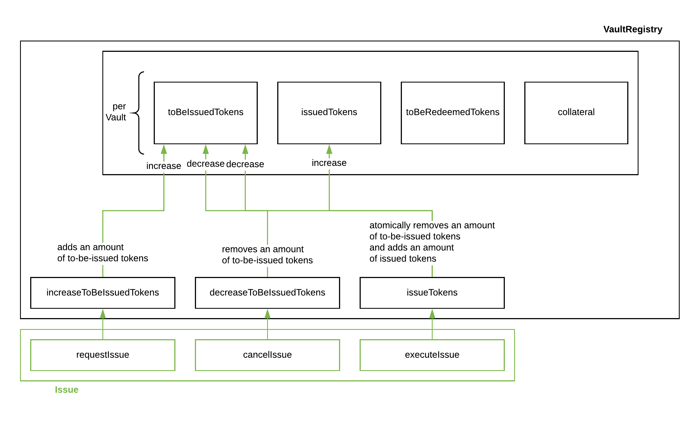

.. _issue-protocol:

Issue
=====

Overview
~~~~~~~~

The Issue module allows as user to create new PolkaBTC tokens. The user needs to request PolkaBTC through the :ref:`requestIssue` function, then send BTC to a Vault, and finally complete the issuing of PolkaBTC by calling the :ref:`executeIssue` function. If the user does not complete the process in time, the vault can cancel the issue request and receive a griefing collateral from the user by invoking the :ref:`cancelIssue` function. Below is a high-level step-by-step description of the protocol.

Step-by-step
------------

1. Precondition: a vault has locked collateral as described in the :ref:`Vault-registry`.
2. A user executes the :ref:`requestIssue` function to open an issue request on the BTC Parachain. The issue request includes the amount of PolkaBTC the user wants to issue, the selected vault, and a small collateral to prevent :ref:`griefing`.
3. A user sends the equivalent amount of BTC that he wants to issue as PolkaBTC to the vault on the Bitcoin blockchain. The user extracts a transaction inclusion proof of that locking transaction on the Bitcoin blockchain.
4. The user executes the :ref:`executeIssue` function on the BTC Parachain. The issue function requires a reference to the previous issue request and the transaction inclusion proof of the Bitcoin locking transaction. If the function completes successfully, the user receives the requested amount of PolkaBTC into his account.
5. Optional: If the user is not able to complete the issue request within the predetermined time frame (``IssuePeriod``), the vault is able to call the :ref:`cancelIssue` function to cancel the issue request.

VaultRegistry
-------------

The data access and state changes to the vault registry are documented in the figure below.

.. _fig-vault-registry-issue:

    The issue protocol interacts with three functions in the vault registry that handle updating the different token balances.

Data Model
~~~~~~~~~~

.. .. todo:: We need to handle replay attacks. Idea: include a short unique hash, e.g. the ``issueId`` and the ``RedeemId`` in the BTC transaction in the ``OP_RETURN`` field. That way, we can check if it is the correct transaction.

.. .. todo:: The hash creation for ``issueId`` and ``RedeemId`` must be unique. Proposal: use a combination of Substrate's ``random_seed()`` method together with a ``nonce`` and the ``AccountId`` of a CbA-user and CbA-Redeemer. 

.. .. warning:: Substrate's built in module to generate random data needs 80 blocks to actually generate random data.

Scalars
-------

IssueGriefingCollateral
........................

The minimum collateral (DOT) a user needs to provide as griefing protection. 

.. note:: Serves as a measurement to disincentivize griefing attacks against a vault. A user could otherwise create an issue request, temporarily locking a vault's collateral and never execute the issue process.

*Substrate* ::
    
    IssueGriefingCollateral: Balance;

IssuePeriod
............

The time difference in number of blocks between an issue request is created and required completion time by a user. The issue period has an upper limit to prevent griefing of vault collateral.

*Substrate* ::

  IssuePeriod: T::BlockNumber;

Maps
----

IssueRequests
.............

Users create issue requests to issue PolkaBTC. This mapping provides access from a unique hash ``IssueId`` to a ``Issue`` struct. ``<IssueId, Issue>``.

*Substrate* ::

  IssueRequests map T::H256 => Issue<T::AccountId, T::BlockNumber, T::Balance>

Structs
-------

Issue
.....

Stores the status and information about a single issue request.

.. tabularcolumns:: |l|l|L|

======================  ==========  =======================================================	
Parameter               Type        Description                                            
======================  ==========  =======================================================
``vault``               Account     The BTC Parachain address of the Vault responsible for this commit request.
``opentime``            u256        Block height of opening the request.
``griefingCollateral``  DOT         Collateral provided by a user.
``amount``              PolkaBTC    Amount of PolkaBTC to be issued.
``requester``           Account     User account receiving PolkaBTC upon successful issuing.
``btcAddress``          bytes[20]   Base58 encoded Bitcoin public key of the Vault.  
``completed``           bool        Indicates if the issue has been completed.
======================  ==========  =======================================================

*Substrate*

::
  
  #[derive(Encode, Decode, Default, Clone, PartialEq)]
  #[cfg_attr(feature = "std", derive(Debug))]
  pub struct Issue<AccountId, BlockNumber, Balance> {
        vault: AccountId,
        opentime: BlockNumber,
        griefingCollateral: Balance,
        amount: Balance,
        requester: AccountId,
        btcAddress: H160,
        completed: bool
  }

Functions
~~~~~~~~~

.. _requestIssue:

requestIssue
------------

A user opens an issue request to create a specific amount of PolkaBTC. The user also has to provide a small amount of collateral.
When calling this function, a user provides her own parachain account identifier, the to be issued amount of PolkaBTC, and the vault she wants to use in this process (parachain account identifier). Further, she provides some (small) amount of DOT collateral (``griefingCollateral``) to prevent griefing.

Specification
.............

*Function Signature*

``requestIssue(requester, amount, vault, griefingCollateral)``

*Parameters*

* ``requester``: The user's BTC Parachain account.
* ``amount``: The amount of PolkaBTC to be issued.
* ``vault``: The BTC Parachain address of the Vault involved in this issue request.
* ``griefingCollateral``: The collateral amount provided by the user as griefing protection.

*Returns*

* ``issueId``: A unique hash identifying the issue request. 

*Events*

* ``RequestIssue(issueId, requester, amount, vault, btcAddress)``

*Errors*

* ``ERR_INSUFFICIENT_COLLATERAL``: The user did not provide enough griefing collateral.

*Substrate* ::

  fn requestIssue(origin, amount: U256, vault: AccountId, griefingCollateral: DOT) -> Result {...}

Preconditions
.............

* The BTC Parachain status in the :ref:`security` component must be set to ``RUNNING:0``.

Function Sequence
.................

1. Check if the ``griefingCollateral`` is greater or equal ``IssueGriefingCollateral``. If this check fails, return ``ERR_INSUFFICIENT_COLLATERAL``.

2. Lock the user's griefing collateral by calling the :ref:`lockCollateral` function with the ``requester`` as the sender and the ``griefingCollateral`` as the amount.

3. Call the VaultRegistry :ref:`increaseToBeIssuedTokens` function with the ``amount`` of tokens to be issued and the ``vault`` identified by its address. If the vault has not locked enough collateral, throws a ``ERR_EXCEEDING_VAULT_LIMIT`` error. This function returns a ``btcAddress`` that the user should send Bitcoin to.

4. Generate an ``issueId`` by hashing a random seed, a nonce from the security module, and the address of the user.

5. Store a new ``Issue`` struct in the ``IssueRequests`` mapping as ``IssueRequests[issueId] = issue``, where ``issue`` is the ``Issue`` struct as:

    - ``issue.vault`` is the ``vault``
    - ``issue.opentime`` is the current block number
    - ``issue.griefingCollateral`` is the griefing collateral provided by the user
    - ``issue.amount`` is the ``amount`` provided as input
    - ``issue.requester`` is the user's account
    - ``issue.btcAddress`` the Bitcoin address of the Vault as returned in step 3

6. Issue the ``RequestIssue`` event with the ``issueId``, the ``requester`` account, ``amount``, ``vault``, and ``btcAddress``.

7. Return the ``issueId``. The user stores this for future reference and the next steps, locally.

.. lock
.. ----
.. 
.. The user sends BTC to a vault's address.
.. 
.. Specification
.. .............
.. 
.. *Function Signature*
.. 
.. ``lock(requester, amount, vault, issueId)``
.. 
.. *Parameters*
.. 
.. * ``requester``: The user's BTC Parachain account.
.. * ``amount``: The amount of PolkaBTC to be issued.
.. * ``vault``: The BTC Parachain address of the Vault involved in this issue request.
.. * ``issueId``: the unique hash created during the ``requestIssue`` function.
.. 
.. *Returns*
.. 
.. * ``txId``: A unique hash identifying the Bitcoin transaction.
.. 
.. .. todo:: Do we define the Bitcoin transactions here?
.. 
.. *Bitcoin* ::
.. 
..   OP_RETURN
.. 
.. 
.. Function Sequence
.. .................
.. 
.. 1. The user prepares a Bitcoin transaction with the following details:
.. 
..    a. The input(s) must be spendable from the user.
..    b. The transaction has at least two outputs with the following conditions:
.. 
..         1. One output is spendable by the ``btcAddress`` of the Vault selected in the ``requestIssue`` function. The output includes the ``amount`` requested in the ``requestIssue`` function in the ``value`` field. This means the number of requested PolkaBTC must be the same amount of transferred BTC (expressed as satoshis).
..         2. One output must include a ``OP_RETURN`` with the ``issueId`` received in the ``requestIssue`` function. This output will not be spendable and therefore the ``value`` field should be ``0``.
.. 
.. 2. The user sends the transaction prepared in step 1 to the Bitcoin network and locally stores the ``txId``, i.e. the unique hash of the transaction.

.. _executeIssue:

executeIssue
------------

A user completes the issue request by sending a proof of transferring the defined amount of BTC to the vault's address.

Specification
.............

*Function Signature*

``executeIssue(requester, issueId, txId, txBlockHeight, txIndex, merkleProof, rawTx)``

*Parameters*

* ``requester``: the account of the user.
* ``issueId``: the unique hash created during the ``requestIssue`` function,
* ``txId``: The hash of the Bitcoin transaction.
* ``txBlockHeight``: Bitcoin block height at which the transaction is supposedly included.
* ``txIndex``: Index of transaction in the Bitcoin block’s transaction Merkle tree.
* ``MerkleProof``: Merkle tree path (concatenated LE SHA256 hashes).
* ``rawTx``: Raw Bitcoin transaction including the transaction inputs and outputs.

*Returns*

* ``None``: if the transaction can be successfully verified and the function has been called within the time limit.

*Events*

* ``ExecuteIssue(issueId, requester, amount, vault)``: Emits an event with the information about the completed issue request.

*Errors*

* ``ERR_ISSUE_ID_NOT_FOUND``: The ``issueId`` cannot be found.
* ``ERR_COMMIT_PERIOD_EXPIRED``: The time limit as defined by the ``IssuePeriod`` is not met.
* ``ERR_UNAUTHORIZED_USER = Unauthorized: Caller must be associated user``: The caller of this function is not the associated user, and hence not authorized to take this action.

*Substrate* ::

  fn executeIssue(origin, issueId: T::H256, txId: T::H256, txBlockHeight: U256, txIndex: u64, merkleProof: Bytes, rawTx: Bytes) -> Result {...}

Preconditions
.............

* The BTC Parachain status in the :ref:`security` component must be set to ``RUNNING:0``.

.. todo:: REJECT any Issue request where the sender BTC address belongs to an existing Vault.

Function Sequence
.................

.. note:: The accepted Bitcoin transaction format for this function is specified in the BTC-Relay specification and can be found at `https://interlay.gitlab.io/polkabtc-spec/btcrelay-spec/intro/accepted-format.html <https://interlay.gitlab.io/polkabtc-spec/btcrelay-spec/intro/accepted-format.html>`_.

.. warning:: Ideally the ``SecureCollateralThreshold`` in the VaultRegistry should be high enough to prevent the Vault from entering into the liquidation or auction state.

1. The user prepares the inputs and calls the ``executeIssue`` function.
    
    a. ``requester``: The BTC Parachain address of the requester.
    b. ``issueId``: The unique hash received in the ``requestIssue`` function.
    c. ``txId``: the hash of the Bitcoin transaction to the Vault. With the ``txId`` the user can get the remainder of the Bitcoin transaction data including ``txBlockHeight``, ``txIndex``, ``MerkleProof``, and ``rawTx``. See BTC-Relay documentation for details.

2. Checks if the ``issueId`` exists. Return ``ERR_ISSUE_ID_NOT_FOUND`` if not found. Else, loads the according issue request struct as ``issue``.
3. Checks if the ``requester`` is the ``issue.requester``. Return ``ERR_UNAUTHORIZED_USER`` if called by any account other than the associated ``issue.requester``.
4. Checks if the current block height minus the ``IssuePeriod`` is smaller than the ``issue.opentime``. If this condition is false, throws ``ERR_COMMIT_PERIOD_EXPIRED``.

5. Verify the transaction.

    a. Call *verifyTransactionInclusion* in :ref:`btc-relay`, providing ``txid``, ``txBlockHeight``, ``txIndex``, and ``merkleProof`` as parameters. If this call returns an error, abort and return the received error. 
    b. Call *validateTransaction* in :ref:`btc-relay`, providing ``rawTx``, the amount of to-be-issued BTC (``issue.amount``), the ``vault``'s Bitcoin address (``issue.btcAddress``), and the ``issueId`` as parameters. If this call returns an error, abort and return the received error. 

6. Call the :ref:`issueTokens` with the ``issue.vault`` and the ``amount`` to decrease the ``toBeIssuedTokens`` and increase the ``issuedTokens``.
7. Call the :ref:`mint` function in the Treasury with the ``amount`` and the user's address as the ``receiver``.
8. Remove the ``IssueRequest`` from ``IssueRequests``.
9. Emit an ``ExecuteIssue`` event with the user's address, the issueId, the amount, and the Vault's address.
10. Return.

.. _cancelIssue:

cancelIssue
-----------

If an issue request is not completed on time, the issue request can be cancelled.

Specification
.............

*Function Signature*

``cancelIssue(sender, issueId)``

*Parameters*

* ``sender``: The sender of the cancel transaction.
* ``issueId``: the unique hash of the issue request.

*Returns*

* ``None``: Does not return anything.

*Events*

* ``CancelIssue(sender, issueId)``: Issues an event with the ``issueId`` that is cancelled.

*Errors*

* ``ERR_ISSUE_ID_NOT_FOUND``: The ``issueId`` cannot be found.
* ``ERR_TIME_NOT_EXPIRED``: Raises an error if the time limit to call ``executeIssue`` has not yet passed.
* ``ERR_ISSUE_COMPLETED``: Raises an error if the issue is already completed.

*Substrate* ::

  fn cancelIssue(origin, issueId) -> Result {...}

Preconditions
.............

* None.

Function Sequence
.................

1. Check if an issue with id ``issueId`` exists. If not, throw ``ERR_ISSUE_ID_NOT_FOUND``. Otherwise, load the issue request  as ``issue``.

2. Check if the expiry time of the issue request is up, i.e ``issue.opentime + IssuePeriod < now``. If the time is not up, throw ``ERR_TIME_NOT_EXPIRED``.

3. Check if the ``issue.completed`` field is set to true. If yes, throw ``ERR_ISSUE_COMPLETED``.

4. Call the :ref:`decreaseToBeIssuedTokens` function in the VaultRegistry with the ``issue.vault`` and the ``issue.amount`` to release the vault's collateral.

5. Call the :ref:`slashCollateral` function to transfer the ``griefingCollateral`` of the user requesting the issue to the vault assigned to this issue request with the ``issue.requester`` as sender, the ``issue.vault`` as receiver, and ``issue.griefingCollateral`` as amount.

6. Remove the ``IssueRequest`` from ``IssueRequests``.

8. Emit a ``CancelIssue`` event with the ``issueId``.

9. Return.

Events
~~~~~~

RequestIssue
------------

Emit a ``RequestIssue`` event if a user successfully open a issue request.

*Event Signature*

``RequestIssue(issueId, requester, amount, vault, btcAddress)``

*Parameters*

* ``issueId``: A unique hash identifying the issue request. 
* ``requester``: The user's BTC Parachain account.
* ``amount``: The amount of PolkaBTC to be issued.
* ``vault``: The BTC Parachain address of the Vault involved in this issue request.
* ``btcAddress``: The Bitcoin address of the vault.

*Functions*

* :ref:`requestIssue`

*Substrate* ::

  RequestIssue(H256, AccountId, U256, AccountId, H160);

ExecuteIssue
------------

*Event Signature*

``ExecuteIssue(issueId, requester, amount, vault)``

*Parameters*

* ``issueId``: A unique hash identifying the issue request. 
* ``requester``: The user's BTC Parachain account.
* ``amount``: The amount of PolkaBTC to be issued.
* ``vault``: The BTC Parachain address of the Vault involved in this issue request.

*Functions*

* :ref:`executeIssue`

*Substrate* ::

  ExecuteIssue(H256, AccountId, U256, AccountId);

CancelIssue
-----------

*Event Signature*

``CancelIssue(issueId, sender)``

*Parameters*

* ``issueId``: the unique hash of the issue request.
* ``sender``: The sender of the cancel transaction.

*Functions*

* :ref:`cancelIssue`

*Substrate* ::
  
    CancelIssue(H256, AccountId);

Error Codes
~~~~~~~~~~~

``ERR_INSUFFICIENT_COLLATERAL``

* **Message**: "User provided collateral below limit."
* **Function**: :ref:`requestIssue`
* **Cause**: User provided griefingCollateral below ``IssueGriefingCollateral``.

``ERR_UNAUTHORIZED_USER``

* **Message**: "Unauthorized: Caller must be associated user"
* **Function**: :ref:`executeIssue`
* **Cause**: The caller of this function is not the associated user, and hence not authorized to take this action.

``ERR_ISSUE_ID_NOT_FOUND``

* **Message**: "Requested issue id not found."
* **Function**: :ref:`executeIssue`
* **Cause**: Issue id not found in the ``IssueRequests`` mapping.

``ERR_COMMIT_PERIOD_EXPIRED``

* **Message**: "Time to issue PolkaBTC expired."
* **Function**: :ref:`executeIssue`
* **Cause**: The user did not complete the issue request within the block time limit defined by the ``IssuePeriod``.

``ERR_TIME_NOT_EXPIRED``

* **Message**: "Time to issue PolkaBTC not yet expired."
* **Function**: :ref:`cancelIssue`
* **Cause**: Raises an error if the time limit to call ``executeIssue`` has not yet passed.

``ERR_ISSUE_COMPLETED``

* **Message**: "Issue completed and cannot be cancelled."
* **Function**: :ref:`cancelIssue`
* **Cause**: Raises an error if the issue is already completed.

