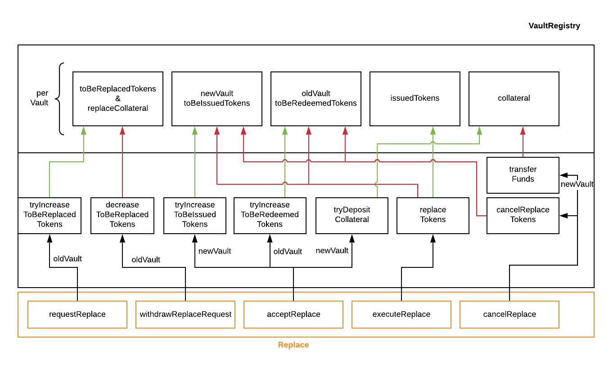

.. _replace-protocol:

Replace
=======

Overview
~~~~~~~~~

The Replace module allows a Vault (*OldVault*) be replaced by transferring the BTC it is holding locked to another Vault (*NewVault*), which provides the necessary DOT collateral. As a result, the DOT collateral of the *OldVault*, corresponding to the amount of replaced BTC, is unlocked. The *OldVault* must thereby provide some amount of collateral to protect against griefing attacks, where the *OldVault* never finalizes the Replace protocol and the *NewVault* hence temporarily locked DOT collateral for nothing.

Conceptually, the Replace protocol resembles a SPV atomic cross-chain swap.

Step-by-Step
-------------

1. Precondition: a Vault (*OldVault*) has locked DOT collateral in the `Vault Registry <vault-registry>`_ and has issued PolkaBTC tokens, i.e., holds BTC on Bitcoin.

2. *OldVault* submits a replacement request, indicating how much BTC is to be migrated by calling the :ref:`requestReplace` function. 

   * *OldVault* is required to lock some amount of DOT collateral (``ReplaceGriefingCollateral``) as griefing protection, to prevent *OldVault* from holding *NewVault*'s DOT collateral locked in the BTC Parachain without ever finalizing the redeem protocol (transfer of BTC). 

3. Optional: If an *OldVault* has changed its mind or can't find a *NewVault* to replace it, it can call the :ref:`withdrawReplaceRequest` function to invalidate its request. If the request is already accepted (step 4), then this function cannot be invoked.

4. A new candidate Vault (*NewVault*), commits to executing the replacement by locking up the necessary DOT collateral to back the to-be-transferred BTC (according to the ``SecureCollateralThreshold``) by calling the :ref:`acceptReplace` function.. 

5. Within a pre-defined delay, *OldVault* must release the BTC on Bitcoin to *NewVault*'s BTC address, and submit a valid transaction inclusion proof by calling the :ref:`executeReplace` function (call to ``verifyTransactionInclusion`` in :ref:`btc-relay`). If *OldVault* releases the BTC to *NewVault* correctly and submits the transaction inclusion proof to Replace module on time, *OldVault*'s DOT collateral is released - *NewVault* has now replaced *OldVault*.

  * Note: to prevent *OldVault* from trying to re-use old transactions (or other payments to *NewVaults* on Bitcoin) as fake proofs, we require *OldVault* to include a ``nonce`` in an OP_RETURN output of the transfer transaction on Bitcoin.

6. Optional: If *OldVault* fails to provide the correct transaction inclusion proof on time, the *NewVault*'s ``collateral`` is unlocked and *OldVault*'s ``griefingCollateral`` is sent to the *NewVault* as reimbursement for the opportunity costs of locking up DOT collateral via the :ref:`cancelReplace` function. 

VaultRegistry
-------------

The data access and state changes to the vault registry are documented in the figure below.

Data Model
~~~~~~~~~~

Scalars
-------

ReplaceGriefingCollateral
.........................

The minimum collateral (DOT) a Vault requesting a replacement needs to provide as griefing protection. 

.. note:: Requiring a Vault to add DOT collateral for executing replace may be a problem for Vaults which trigger this process due to low collateralization rates. We can potentially slash some of the Vault's existing collateral instead - this will result in reducing the collateralization rate and move the Vault closer to liquidation.

*Substrate*::

  ReplaceGriefingCollateral: Balance;

ReplacePeriod
.............

The time difference in number of blocks between a replace request is accepted by another Vault and the transfer of BTC (and submission of the transaction inclusion proof) by the to-be-replaced Vault. The replace period has an upper limit to prevent griefing of Vault collateral.

*Substrate* ::

  ReplacePeriod: T::BlockNumber;

Maps
----

ReplaceRequests
...............

Vaults create replace requests if they want to have (a part of) their DOT collateral to be replaced by other Vaults. This mapping provides access from a unique hash ``ReplaceId`` to a ``ReplaceRequest`` struct. ``<ReplaceId, Replace>``.

*Substrate* ::

  ReplaceRequests map T::H256 => Replace<T::AccountId, T::BlockNumber, T::Balance>;

Structs
-------

Replace
.......

Stores the status and information about a single replace request.

.. tabularcolumns:: |l|l|L|

======================  ==========  =======================================================	
Parameter               Type        Description                                            
======================  ==========  =======================================================
``oldVault``            Account     BTC Parachain account of the Vault that is to be replaced.
``opentime``            u256        Block height of opening the request.
``amount``              PolkaBTC    Amount of BTC / PolkaBTC to be replaced.
``griefingCollateral``  DOT         Griefing protection collateral locked by ``oldVault``.
``newVault``            Account     Account of the new Vault, which accepts the replace request.
``collateral``          DOT         DOT collateral locked by the new Vault.
``acceptTime``          u256        Block height at which this replace request was accepted by a new Vault. Serves as start for the countdown until when the old Vault must transfer the BTC.
``btcAddress``          bytes[20]   Base58 encoded Bitcoin public key of the new Vault.  
====================== ==========  =======================================================

.. note:: The ``btcAddress`` parameter is not to be set the the new Vault, but is extracted from the ``Vaults`` mapping in ``VaultRegistry`` for the account of the new Vault.  

*Substrate*

::
  
  #[derive(Encode, Decode, Default, Clone, PartialEq)]
  #[cfg_attr(feature = "std", derive(Debug))]
  pub struct Commit<AccountId, BlockNumber, Balance, H160>  {
        oldVault: AccountId,
        opentime: BlockNumber,
        amount: Balance,
        griefingCollateral: Balance,
        newVault: AccountId,
        collateral: Balance,
        acceptTime: BlockNumber,
        btcAddress: H160
  }

Functions
~~~~~~~~~

.. _requestReplace:

requestReplace
--------------

An *OldVault* (to-be-replaced Vault) submits a request to be (partially) replaced. 

Specification
.............

*Function Signature*

``requestReplace(oldVault, btcAmount, timeout, griefingCollateral)``

*Parameters*

* ``oldVault``: Account identifier of the Vault to be replaced (as tracked in ``Vaults`` in :ref:`vault-registry`).
* ``btcAmount``: Integer amount of BTC / PolkaBTC to be replaced.
* ``timeout``: Time in blocks after which this request expires.
* ``griefingCollateral``: collateral locked by the ``oldVault`` as griefing protection

*Returns*

* ``replaceID``: A unique hash identifying the replace request. 

*Events*

* ``ReplaceRequested(oldVault, btcAmount, timeout, replaceId)``:

*Errors*

* ``ERR_UNKNOWN_VAULT = "There exists no Vault with the given account id"``: The specified Vault does not exist. 
* ``ERR_MIN_AMOUNT``: The remaining DOT collateral (converted from the requested BTC replacement value given the current exchange rate) would be below the ``MinimumCollateralVault`` as defined in ``VaultRegistry``.
* ``ERR_UNAUTHORIZED = Unauthorized: Caller must be associated Vault``: The caller of this function is not the associated Vault, and hence not authorized to take this action.

*Substrate* ::

  fn requestReplace(origin, amount: U256, timeout: BlockNumber) -> Result {...}

Preconditions
...............

* The BTC Parachain status in the :ref:`security` component must be set to ``RUNNING:0``.

Function Sequence
.................

1. Check that caller of the function is indeed the to-be-replaced Vault. Return ``ERR_UNAUTHORIZED`` error if this check fails.

2. Retrieve the ``vault`` as per the ``oldVault`` account identifier from ``Vaults`` in the ``VaultRegistry``. Return ``ERR_UNKNOWN_VAULT`` if no Vault can be found.

3. Check that the requested ``btcAmount`` is equal to or lower than ``vault.issuedTokens`` mins the ``vault.toBeRedeemedTokens``.

  a. If ``btcAmount > vault.issuedTokens`` set ``btcAmount = vault.issuedTokens`` (i.e., the request is for the entire BTC holdings of the Vault).

4. If the request is not for the entire BTC holdings, check that the remaining DOT collateral of the Vault is higher than ``MinimumCollateralVault`` as defined in ``VaultRegistry``. Return ``ERR_MIN_AMOUNT`` error if this check fails.

5. Check that the ``griefingCollateral`` is greater or equal ``ReplaceGriefingCollateral``

6. Lock the *oldVault*'s griefing collateral by calling :ref:`lockCollateral` and passing ``oldVault`` and ``griefingCollateral`` as parameters.

7. Call the :ref:`increaseToBeRedeemedTokens` function with the ``oldVault`` and the ``btcAmount`` to ensure that the oldVault's tokens cannot be redeemed when a replace procedure is happening.

8. Generate a ``replaceId`` by hashing a random seed, a nonce, and the address of the Requester.

9. Create new ``ReplaceRequest`` entry:

   * ``Replace.oldVault = vault``,
   * ``Replace.opentime`` = current time on Parachain,
   * ``Replace.amount = amount``,
   * ``Replace.griefingCollateral = griefingCollateral``.
   
10. Emit ``ReplaceRequested(vault, btcAmount, timeout, replaceId)`` event.  

11. Return the ``replaceId``.

.. _withdrawReplaceRequest:

withdrawReplaceRequest
-----------------------

The *OldVault* withdraws an existing ReplaceRequest that is made.

.. note:: If a Vault is under the ``AuctionCollateralThreshold``, the Vault cannot withdraw a replace request. 

Specification
.............

*Function Signature*

``withdrawReplaceRequest(oldVault, replaceId)``

*Parameters*

* ``oldVault``: Account identifier of the Vault withdrawing it's replace request (as tracked in ``Vaults`` in :ref:`vault-registry`)
* ``repalceId``: The identifier of the replace request in ``ReplaceRequests``.

*Events*

* ``WithdrawReplaceRequest(oldVault, replaceId)``: emits an event stating that a Vault (``oldVault``) has withdrawn an existing replace request (``requestId``).

*Errors*

* ``ERR_INVALID_REPLACE_ID =  No ReplaceRequest with given identifier found``: The provided ``replaceId`` was not found in ``ReplaceRequests``.
* ``ERR_UNAUTHORIZED = Unauthorized: Caller must be associated Vault``: The caller of this function is not the associated Vault, and hence not authorized to take this action.
* ``ERR_CANCEL_ACCEPTED_REQUEST = Cannot cancel the ReplaceRequest as it was already accepted by a Vault``: The ``ReplaceRequest`` was already accepted by another Vault and can hence no longer be withdrawn.

*Substrate* ::

  fn WithdrawReplaceRequest(origin, replaceId: H256) -> Result {...}

Preconditions
...............

The ReplaceRequest must have not yet been accepted by another Vault.

Function Sequence
..................

1. Retrieve the ``ReplaceRequest`` as per the ``replaceId`` parameter from ``Vaults`` in the ``VaultRegistry``. Return ``ERR_INVALID_REPLACE_ID`` error if no such ``ReplaceRequest`` was found.

2. Check that caller of the function is indeed the to-be-replaced Vault as specified in the ``ReplaceRequest``. Return ``ERR_UNAUTHORIZED`` error if this check fails.

3. Check that the collateral rate of the vault is not under the ``AuctionCollateralThreshold`` as defined in the VaultRegistry. If it is under the ``AuctionCollateralThreshold`` return ``ERR_UNAUTHORIZED``. 
   
4. Check that the ``ReplaceRequest`` was not yet accepted by another Vault. Return ``ERR_CANCEL_ACCEPTED_REQUEST`` error if this check fails.

5. Release the *oldVault*'s griefing collateral associated with this ``ReplaceRequests`` by calling :ref:`releaseCollateral` and passing the ``oldVault`` and ``griefingCollateral`` as parameters.

6. Call the :ref:`decreaseToBeRedeemedTokens` function in the VaultRegistry to allow the vault to be part of other redeem or replace requests again.

7. Remove the ``ReplaceRequest`` from ``ReplaceRequests``.

8. Emit a ``WithdrawReplaceRequest(oldVault, replaceId)`` event.
 
9. Return.

.. _acceptReplace:

acceptReplace
--------------

A *NewVault* accepts an existing replace request, locking the necessary DOT collateral.

.. note:: When issuing tokens, we increase the ``toBeIssuedTokens`` by a vault. Also, when a vault locks collateral via the ``registerVault`` and ``lockCollateral`` function in the VaultRegistry, we would add collateral to the ``collateral`` field of a vault. However, we are *not* updating the ``collateral`` and ``toBeIssuedTokens`` tokens here. if a vault decides to provide a very high collateral rate, way over the ``SecureCollateralThreshold`` and wants to back the replace with that, we are not interferring with this. If we would lock his collateral in the ``collateral`` field in the VaultRegistry, as user could block part of this collateral with an issue request.

Specification
.............

*Function Signature*

``acceptReplace(newVault, replaceId, collateral)``

*Parameters*

* ``newVault``: Account identifier of the Vault accepting the replace request (as tracked in ``Vaults`` in :ref:`vault-registry`)
* ``repalceId``: The identifier of the replace request in ``ReplaceRequests``.
* ``collateral``: DOT collateral provided to match the replace request (i.e., for backing the locked BTC). Can be more than the necessary amount.

*Events*

* ``AcceptReplace(newVault, replaceId, collateral)``: emits an event stating which Vault (``newVault``) has accepted the ``ReplaceRequest`` request (``requestId``), and how much collateral in DOT it provided (``collateral``).

*Errors*

* ``ERR_INVALID_REPLACE_ID =  No ReplaceRequest with given identifier found``: The provided ``replaceId`` was not found in ``ReplaceRequests``.
* ``ERR_INSUFFICIENT_COLLATERAL``: The provided collateral is insufficient to match the replace request. 
* ``ERR_VAULT_NOT_FOUND``: The caller of the function was not found in the existing ``Vaults`` list in ``VaultRegistry``.

*Substrate* ::

  fn acceptReplace(origin, replaceId: H256, collateral: Balance) -> Result {...}

Preconditions
...............

The BTC Parachain status in the :ref:`security` component must be set to ``RUNNING:0``.

Function Sequence
..................

1. Retrieve the ``ReplaceRequest`` as per the ``replaceId`` parameter from  ``ReplaceRequests``. Return ``ERR_INVALID_REPLACE_ID`` error if no such ``ReplaceRequest`` was found.

2. Retrieve the ``vault`` as per the ``newVault`` parameter from ``Vaults`` in the ``VaultRegistry``. Return ``ERR_VAULT_NOT_FOUND`` error if no such Vault can be found.

3. Check that the provided ``collateral`` exceeds the necessary amount, i.e., ``collateral >= SecureCollateralThreshold * Replace.btcAmount``. Return ``ERR_INSUFFICIENT_COLLATERAL`` error if this check fails.

4. Lock the *newVault*'s collateral by calling :ref:`lockCollateral` and providing ``newVault`` and ``collateral`` as parameters.

5. Update the ``ReplaceRequest`` entry:

  * ``Replace.newVault = newVault``,
  * ``Replace.acceptTime`` = current Parachain time, 
  * ``Replace.btcAddress = btcAddress`` (new Vault's BTC address),
  * ``Replace.collateral = collateral`` (DOT collateral locked by new Vault).

6. Emit a ``AcceptReplace(newVault, replaceId, collateral)`` event.

.. _auctionReplace:

auctionReplace
--------------

A *NewVault* enforces the replace of an *oldVault*. This is possible when the *oldVault* is below the ``AuctionCollateralThreshold``. The function creates a replace request that cannot be withdrawn by the *oldVault*.

.. note:: When issuing tokens, we increase the ``toBeIssuedTokens`` by a vault. Also, when a vault locks collateral via the ``registerVault`` and ``lockCollateral`` function in the VaultRegistry, we would add collateral to the ``collateral`` field of a vault. However, we are *not* updating the ``collateral`` and ``toBeIssuedTokens`` tokens here. if a vault decides to provide a very high collateral rate, way over the ``SecureCollateralThreshold`` and wants to back the replace with that, we are not interferring with this. If we would lock his collateral in the ``collateral`` field in the VaultRegistry, as user could block part of this collateral with an issue request.

Specification
.............

*Function Signature*

``auctionReplace(newVault, oldVault, btcAmount, collateral)``

*Parameters*

* ``newVault``: Account identifier of the Vault auctioning the replace request (as tracked in ``Vaults`` in :ref:`vault-registry`)
* ``oldVault``: Account identifier of the Vault to be replaced (as tracked in Vaults in :ref:`vault-registry`).
* ``btcAmount``: Integer amount of BTC / PolkaBTC to be replaced.
* ``collateral``: DOT collateral provided to match the replace request (i.e., for backing the locked BTC). Can be more than the necessary amount.

*Events*

* ``ReplaceRequested(oldVault, btcAmount, timeout, replaceId)``
* ``AuctionReplace(newVault, replaceId, collateral)``: emits an event stating which Vault (``newVault``) has auctioned the ``ReplaceRequest`` request (``requestId``), and how much collateral in DOT it provided (``collateral``).

*Errors*

* ``ERR_SUFFICIENT_COLLTERAL_RATE``: The *oldVault* is not below the ``AuctionCollateralThreshold``.
* ``ERR_INSUFFICIENT_COLLATERAL``: The provided collateral is insufficient to match the replace request. 
* ``ERR_VAULT_NOT_FOUND``: The caller of the function was not found in the existing ``Vaults`` list in ``VaultRegistry``.

*Substrate* ::

  fn auctionReplace(origin, replaceId: H256, collateral: Balance) -> Result {...}

Preconditions
...............

The BTC Parachain status in the :ref:`security` component must be set to ``RUNNING:0``.

Function Sequence
..................

1. Retrieve the ``newVault`` as per the ``newVault`` parameter from ``Vaults`` in the ``VaultRegistry``. Return ``ERR_VAULT_NOT_FOUND`` error if no such Vault can be found.

2. Retrieve the ``oldVault`` as per the ``oldVault`` parameter from ``Vaults`` in the ``VaultRegistry``. Return ``ERR_VAULT_NOT_FOUND`` error if no such Vault can be found.

3. Check that the ``oldVault`` is below the ``AuctionCollateralThreshold`` by calculating his current ``oldVault.issuedTokens`` and the ``oldVault.collateral``. If not throw ``ERR_SUFFICIENT_COLLATERAL_RATE``.

4. Check that the provided ``collateral`` exceeds the necessary amount, i.e., ``collateral >= SecureCollateralThreshold * btcAmount``. Return ``ERR_INSUFFICIENT_COLLATERAL`` error if this check fails.

5. Lock the *newVault*'s collateral by calling :ref:`lockCollateral` and providing ``newVault`` and ``collateral`` as parameters.

6. Call the :ref:`increaseToBeRedeemedTokens` function with the ``oldVault`` and the ``btcAmount`` to ensure that the oldVault’s tokens cannot be redeemed when a replace procedure is happening.

7. Generate a ``replaceId`` by hashing a random seed, a nonce, and the address of the ``newVault``.

8. Create a new ``ReplaceRequest`` named ``replace`` entry:

  * ``replace.newVault = newVault``,
  * ``replace.oldVault = oldVault``,
  * ``replace.openTime`` = current Parachain time, 
  * ``replace.acceptTime`` = current Parachain time,
  * ``replace.amount = btcAmount``,
  * ``replace.griefingCollateral = 0``,
  * ``replace.btcAddress = newVault.btcAddress`` (new Vault's BTC address),
  * ``replace.collateral = collateral`` (DOT collateral locked by new Vault).

9. Emit a ``AuctionReplace(newVault, replaceId, collateral)`` event.

10. Emit a ``ReplaceRequested(oldVault, btcAmount, timeout, replaceId)`` event.

11. Return.

.. _executeReplace: 

executeReplace
--------------

The to-be-replaced Vault finalizes the replace process by submitting a proof that it transferred the correct amount of BTC to the BTC address of the new Vault, as specified in the ``ReplaceRequest``.
This function calls *verifyTransactionInclusion* in :ref:`btc-relay`, proving a transaction inclusion proof (``txid``, ``txBlockHeight``, ``txIndex``, and ``merkleProof``) as input, as well as *validateTransaction* proving the ``rawTx``, ``replaceId`` and the *newVault*'s Bitcoin address as parameters.

Specification
.............

*Function Signature*

``executeReplace(newVault, replaceId, txId, txBlockHeight, txIndex, merkleProof, rawTx)``

*Parameters*

* ``newVault``: Account identifier of the Vault accepting the replace request (as tracked in ``Vaults`` in :ref:`vault-registry`)
* ``repalceId``: The identifier of the replace request in ``ReplaceRequests``.
* ``txId``: The hash of the Bitcoin transaction.
* ``txBlockHeight``: Bitcoin block height at which the transaction is supposedly included.
* ``txIndex``: Index of transaction in the Bitcoin block’s transaction Merkle tree.
* ``MerkleProof``: Merkle tree path (concatenated LE SHA256 hashes).
* ``rawTx``: Raw Bitcoin transaction including the transaction inputs and outputs.

*Events*

* ``ExecuteReplace(oldVault, newVault, replaceId)``: emits an event stating that the old Vault (``oldVault``) has executed the BTC transfer to the new Vault (``newVault``), finalizing the ``ReplaceRequest`` request (``requestId``).

*Errors*

* ``ERR_INVALID_REPLACE_ID =  No ReplaceRequest with given identifier found``: The provided ``replaceId`` was not found in ``ReplaceRequests``.
* ``ERR_VAULT_NOT_FOUND = No Vault with given Account identifier found``: The caller of the function was not found in the existing ``Vaults`` list in ``VaultRegistry``.
* ``ERR_PERIOD_EXPIRED = Replace request expired``: 
* See errors returned by *verifyTransactionInclusion* and *validateTransaction* in :ref:`btc-relay`.

*Substrate* ::

  fn executeReplace(origin, replaceId: H256, collateral: Balance) -> Result {...}

Preconditions
...............

* The BTC Parachain status in the :ref:`security` component must be set to ``RUNNING:0``.
* The to-be-replaced Vault transferred the correct amount of BTC to the BTC address of the new Vault on Bitcoin, and has generated a transaction inclusion proof. 

Function Sequence
..................

1. Retrieve the ``ReplaceRequest`` as per the ``replaceId`` parameter from ``Vaults`` in the ``VaultRegistry``. Return ``ERR_INVALID_REPLACE_ID`` error if no such ``ReplaceRequest`` request was found.

2. Check that the current Parachain block height minus the ``ReplacePeriod`` is smaller than the ``opentime`` of the ``ReplaceRequest``. Throw ``ERR_PERIOD_EXPIRED`` if false.

3. Retrieve the ``Vault`` as per the ``newVault`` parameter from ``Vaults`` in the ``VaultRegistry``. Return ``ERR_VAULT_NOT_FOUND`` error if no such Vault can be found.

4. Call *verifyTransactionInclusion* in :ref:`btc-relay`, providing ``txid``, ``txBlockHeight``, ``txIndex``, and ``merkleProof`` as parameters. If this call returns an error, abort and return the received error. 

5. Call *validateTransaction* in :ref:`btc-relay`, providing ``rawTx``, the amount of to-be-replaced BTC (``Replace.amount``), the ``newVault``'s Bitcoin address (``Vault.btcAddress``), and the ``replaceId`` as parameters. If this call returns an error, abort and return the received error. 

6. Call the :ref:`replaceTokens` function in the VaultRegistry with the ``newVault``, ``oldVault``, ``amount``, and the ``collateral`` to increase the ``issuedTokens`` amount of the ``newVault`` as well as its ``collateral``. Further, this decreases the ``issuedTokens`` and ``toBeRedeemedTokens`` of the ``oldVault``.

7. Call the :ref:`releaseCollateral` function to release the ``oldVaults`` griefing collateral ``griefingCollateral``.

8. Emit the ``ExecuteReplace(oldVault, newVault, replaceId)`` event.

9. Remove the ``ReplaceRequest`` from ``ReplaceRequests``.

10. Return.

.. note:: It can be the case that the to-be-replaced *OldVault* controls a significant numbers of Bitcoin UTXOs with user funds, making it impossible to execute the migration of funds to the *NewVault* within a single Bitcoin transaction. As a result, it may be necessary to "merge" these UTXOs using multiple "merge transactions" on Bitcoin, i.e., transactions which takes as input multiple UTXOs controlled by the *OldVault* and create a single UTXO controlled (again) by the *OldVault*. Once the UTXOs produced by "merge transactions" can be merged by a single, final transaction, the *OldVault* moves the funds to the *NewVault*. (An alternative is to allow the *OldVault* to submit multiple transaction inclusion proofs when calling ``executeReplace``, although this significantly increases the complexity of transaction parsing on the BTC Parachain side).

.. _cancelReplace:

cancelReplace
-------------

If a replace request is not executed on time, the replace can be cancelled by the new vault. Since the new vault provided additional collateral in vain, it can claim the old vault's griefing collateral.

Specification
.............

*Function Signature*

``cancelReplace(newVault, replaceId)``

*Parameters*

* ``newVault``: Account identifier of the Vault accepting the replace request (as tracked in ``Vaults`` in :ref:`vault-registry`)
* ``repalceId``: The identifier of the replace request in ``ReplaceRequests``.

*Events*

* ``CancelReplace(newVault, oldVault, replaceId)``: emits an event stating that the old Vault (``oldVault``) has not completed the replace request and the new Vault (``newVault``) cancelled the ``ReplaceRequest`` request (``requestId``).

*Errors*

* ``ERR_INVALID_REPLACE_ID =  No ReplaceRequest with given identifier found``: The provided ``replaceId`` was not found in ``ReplaceRequests``.
* ``ERR_VAULT_NOT_FOUND = No Vault with given Account identifier found``: The caller of the function was not found in the existing ``Vaults`` list in ``VaultRegistry``.
* ``ERR_PERIOD_NOT_EXPIRED = Replace request not yet expired``: The old vault can still fulfil the replace request.

*Substrate* ::

  fn cancelReplace(origin, replaceId: H256) -> Result {...}

Preconditions
...............

* The BTC Parachain status in the :ref:`security` component must be set to ``RUNNING:0``.

Function Sequence
..................

1. Retrieve the ``ReplaceRequest`` as per the ``replaceId`` parameter from ``Vaults`` in the ``VaultRegistry``. Return ``ERR_INVALID_REPLACE_ID`` error if no such ``ReplaceRequest`` request was found.

.. note:: If a replace request has been executed successfully, it has been deleted and this error will be thrown.

2. Check that the current Parachain block height minus the ``ReplacePeriod`` is greater than the ``opentime`` of the ``ReplaceRequest``. Throw ``ERR_PERIOD_NOT_EXPIRED`` if false.

3. Retrieve the ``Vault`` as per the ``newVault`` parameter from ``Vaults`` in the ``VaultRegistry``. Return ``ERR_VAULT_NOT_FOUND`` error if no such Vault can be found.

4. Transfer the *oldVault*'s griefing collateral associated with this ``ReplaceRequests`` to the *newVault* by calling :ref:`slashCollateral` and passing the ``oldVault``, ``newVault`` and ``griefingCollateral`` as parameters.

5. Call the :ref:`decreaseToBeRedeemedTokens` function in the VaultRegistry for the *oldVault*.

6. Remove the ``ReplaceRequest`` from ``ReplaceRequests``.

7. Emit a ``CancelReplace(newVault, oldVault, replaceId)`` event.
 
8. Return.
4. 

Events
~~~~~~~

Error Codes
~~~~~~~~~~~

