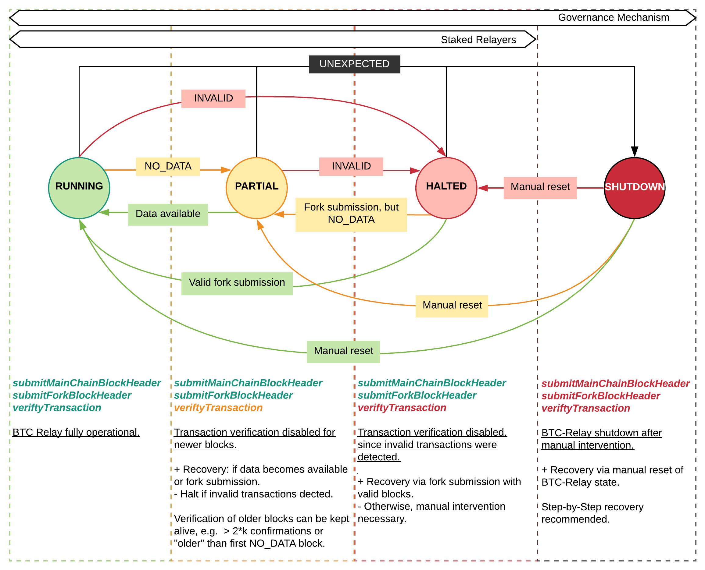

.. _security:

Security
========

The Security module is responsible for failure handling in the BTC Parachain, such as liveness and safety failures of :ref:`btc-relay` or crashes of the :ref:`exchange-rate-oracle`.
Specifically, this module provides a central interface for all other modules to check whether specific features should be disabled to prevent financial damage to users (e.g. stop :ref:`issue-protocol` if no reliable price data is available).
In addition, the Security module provides functions to handle security critical operations, such as generating secure identifiers for replay protection in :ref:`issue-protocol`, :ref:`redeem-protocol`, and :ref:`replace-protocol`. 

Overview
~~~~~~~~

Failure Modes
--------------

The BTC Parachain can enter into different failure modes, depending on the occurred error.
An overview is provided in the figure below.

    (Informal) State machine showing the operational and failure modes of BTC-Relay, and how to recover from or flag failures. Note: within the ``ERROR`` state, ``ErrorCode`` states are only exclusive within a single module (i.e., BTC-Relay ``NO_DATA_BTC_RELAY`` and ``INVALID_BTC_RELAY`` are exclusive, but there can be an ``ORACLE_OFFLINE`` or ``LIQUIDATION`` error in parallel).

More details on the exact failure states and error codes are provided in the Specification part of this module description.

Roles
-----

Failure handling methods calls are **restricted**, i.e., can only be called by pre-determined roles.
We differentiate between:

* **Staked Relayers** - collateralized Parachain participants, whose main role it is to run Bitcoin full nodes and check that:
    
    1. Transactional data is available for submitted Bitcoin block headers (``NO_DATA_BTC_RELAY: 0`` code).
    2. Submitted blocks are valid under Bitcoin's consensus rules  (``INVALID_BTC_RELAY: 1`` code).
    3. Vaults do not move BTC to another Bitcoin address, unless expressly requested during :ref:`redeem-protocol` or :ref:`replace-protocol`.
    4. If a Vault is under-collateralized, i.e., the collateral rate has fallen below ``LiquidationCollateralThreshold``, as defined in :ref:`vault-registry`. 

 If one of the above failures is detected, Staked Relayers file a report with the :ref:`security` module. In cases (1) and (2), a vote is initiated, whereby this module acts as bulleting board and collects Staked Relayer signatures - if a majority is reached, as defined by ``STAKED_RELAYER_VOTE_THRESHOLD``, the state of the BTC Parachain is updated. In cases (3) and (4) a single Staked Relayer report suffices - the Security module checks if the accusation against the Vault is correct, and if yes updates the BTC Parachain state and flags the Vault according to the reported failure.

* **Governance Mechanism** - Parachain Governance Mechanism, voting on critical changes to the architecture or unexpected failures, e.g. hard forks or detected 51% attacks (if a fork exceeds the specified security parameter *k*, see `Security Parameter k <https://interlay.gitlab.io/polkabtc-spec/btcrelay-spec/security_performance/security.html#security-parameter-k>`_.). 

Data Model
~~~~~~~~~~

Constants
---------

STAKED_RELAYER_VOTE_THRESHOLD
...............................

Integer denoting the percentage of Staked Relayer signatures/votes necessary to alter the state of the BTC Parachain (``NO_DATA_BTC_RELAY`` and ``INVALID_BTC_RELAY`` error codes).

.. note:: Must be a number between 0 and 100.

*Substrate* ::

  STAKED_RELAYER_VOTE_THRESHOLD: U8;

STAKED_RELAYER_STAKE
......................

Integer denoting the minimum DOT stake which Staked Relayers must provide when registering. 

*Substrate* ::

  STAKED_RELAYER_STAKE: Balance;

Scalars
--------

ParachainStatus
.................

Integer/Enum (see ``StatusCode`` below). Defines the current state of BTC-Relay. 

*Substrate* ::

  ParachainStatus: T::StatusCode;

Errors
........

Set of error codes (``ErrorCode`` enums), indicating the reason for the error. The ``ErrorCode`` entries included in this set specify how to react to the failure (e.g. shutdown transaction verification in :ref:`btc-relay`).

*Substrate* ::

  Errors: HashSet<T::ErrorCode>;

StatusLog
..........

Array of ``StatusUpdate`` structs, providing a history of status changes of the BTC Parachain. 

*Substrate* ::

  StatusLog: Vec<StatusUpdate>;

StatusCounter
.................

Integer increment-only counter used to track status updates.

*Substrate* ::

  StatusCounter: U256;

Nonce
.....

Integer increment-only counter, used to prevent collisions when generating identifiers for e.g. issue, redeem or replace requests (for OP_RETURN field in Bitcoin).

*Substrate* ::

  Nonce: U256;

Enums
------

StatusCode
...........
Indicated ths status of the BTC Parachain.

* ``RUNNING: 0`` - BTC Parachain fully operational

* ``ERROR: 1``- an error was detected in the BTC Parachain. See ``Errors`` for more details, i.e., the specific error codes (these determine how to react).

* ``SHUTDOWN: 2`` - BTC Parachain operation fully suspended. This can only be achieved via manual intervention by the Governance Mechanism.

*Substrate* 

::

  enum StatusCode {
        RUNNING = 0,
        ERROR = 1,
        SHUTDOWN = 2,
  }

ErrorCode
.........

Enum specifying reasons for error leading to a status update.

* ``NONE : 0`` - no error has occurred (used to simplify implementation). 

* ``NO_DATA_BTC_RELAY: 1`` - it was not possible to fetch transactional data for a block header submitted to :ref:`btc-relay`. 

* ``INVALID_BTC_RELAY : 2`` - an invalid transaction was detected in a block header submitted to :ref:`btc-relay`. 

* ``ORACLE_OFFLINE : 3`` - the :ref:`exchangeRateOracle` experienced a liveness failure (no up-to-date exchange rate available).

* ``LIQUIDATION : 4`` - at least one Vault is either below the ``LiquidationCollateralThreshold`` or has been reported to have stolen BTC. This status implies that any :ref:`redeem-protocol` request will be executed partially in BTC and partially in DOT, until the system is rebalanced (1:1 backing between PolkaBTC and BTC). 

*Substrate*

::
  
  enum ErrorCode {
        NONE = 0
        NO_DATA_BTC_RELAY = 1,
        INVALID_BTC_RELAY = 2,
        ORACLE_OFFLINE = 3,
        LIQUIDATION = 4
  }

ProposalStatus
...............

Indicated the state of a proposed ``StatusUpdate``.

* ``PENDING: 0`` - this ``StatusUpdate`` is current under review and is being voted upon.

* ``ACCEPTED: 1``- this ``StatusUpdate`` has been accepted.

* ``REJECTED: 2`` -this ``StatusUpdate`` has been rejected.

*Substrate* 

::

  enum ProposalStatus {
        PENDING = 0,
        ACCEPTED = 1,
        REJECTED = 2,
  }

Structs
--------

StatusUpdate
.............

Struct providing information for an occurred halting of BTC-Relay. Contains the following fields.

======================  ==============  ============================================
Parameter               Type            Description
======================  ==============  ============================================
``newStatusCode``       StatusCode      New status of the BTC Parachain.
``oldStatusCode``       StatusCode      Previous status of the BTC Parachain.
``errors``              Set<ErrorCode>  If ``newStatusCode`` is ``Error``, specifies the errors.           
``time``                U256            Parachain block number at which this status update was suggested.
``proposalStatus``      ProposalStatus  Status of the proposed status update. See ``ProposalStatus``.
``msg``                 String          Message providing more details on the change of status (detailed error message or recovery reason). 
``votesYes``            Set<AccountId>  Set of accounts which have voted FOR this status update. This can be either Staked Relayers or the Governance Mechanism. Checks are performed depending on the type of status change. Should maintain insertion order to allow checking who proposed this update (at index ``0``). 
``votesNo``             Set<AccountId>  Set of accounts which have voted AGAINST this status update. 
======================  ==============  ============================================

.. note:: ``StatusUpdates`` executed by the Governance Mechanism are not voted upon by Staked Relayers (hence ``votesNo`` will be empty).

*Substrate* 

::

  #[derive(Encode, Decode, Default, Clone, PartialEq)]
  #[cfg_attr(feature = "std", derive(Debug))]
  pub struct StatusUpdate<StatusCode, ErrorCode, BlockNumber, AccountId> {
        newStatusCode: StatusCode,
        oldStatusCode: StatusCode,
        errors: HashSet<ErrorCode>,
        time: BlockNumber,
        msg: String,
        votesYes: HashSet<AccountId>,
        votesNo: HashSet<AccountId>,
  }

StakedRelayer
..............

Stores the information of a Staked Relayer.

.. tabularcolumns:: |l|l|L|

=========================  =========  ========================================================
Parameter                  Type       Description
=========================  =========  ======================================================== 
``stake``                  DOT        Total amount of collateral/stake provided by this Staked Relayer.
=========================  =========  ========================================================

*Substrate* 

::

  #[derive(Encode, Decode, Default, Clone, PartialEq)]
  #[cfg_attr(feature = "std", derive(Debug))]
  pub struct StatusUpdate<Balance> {
        stake: Balance
  }

.. note:: Struct used here in case more information needs to be stored for Staked Relayers, e.g. SLA (votes cast vs. votes missed).

Maps
----

StakedRelayers
...............

Mapping from accounts of StakedRelayers to their struct. ``<Account, StakedRelayer>``.

*Substrate* ::

    StakedRelayers map T::AccountId => StakedRelayer<Balance>

StatusUpdates
..............

Map of ``StatusUpdates``, identified by an integer key. ``<U256, StatusUpdate>``.

*Substrate* ::

    StakedRelayers map U256 => StatusUpdate<StatusCode, ErrorCode, BlockNumber, AccountId>

TheftReports
.............

Mapping of Bitcoin transaction identifiers (SHA256 hashes) to account identifiers of Vaults who have been caught stealing Bitcoin.
Per Bitcoin transaction, multiple Vaults can be accused (multiple inputs can come from multiple Vaults). 
This mapping is necessary to prevent duplicate theft reports.
``<H256, Set<AccountId>>``.

*Substrate* ::

    TheftReports map H256 => HashSet<AccountId>

Functions
~~~~~~~~~

.. _registerStakedRelayer:

registerStakedRelayer
----------------------

Registers a new Staked Relayer, locking the provided collateral, which must exceed ``STAKED_RELAYER_STAKE``.

Specification
.............

*Function Signature*

``registerStakedRelayer(stakedRelayer, stake)``

*Parameters*

* ``stakedRelayer``: The account of the Staked Relayer to be registered.
* ``stake``: to-be-locked collateral/stake in DOT.

*Returns*

* ``None``

*Events*

* ``RegisterStakedRelayer(StakedRelayer, collateral)``: emit an event stating that a new Staked Relayer (``stakedRelayer``) was registered and provide information on the Staked Relayer's stake (``stake``). 

*Errors*

* ``ERR_ALREADY_REGISTERED = "This AccountId is already registered as a Staked Relayer"``: The given account identifier is already registered. 
* ``ERR_INSUFFICIENT_STAKE = "Insufficient stake provided"``: The provided stake was insufficient - it must be above ``STAKED_RELAYER_STAKE``.
  
*Substrate* ::

  fn registerStakedRelayer(origin, amount: Balance) -> Result {...}

Preconditions
.............

Function Sequence
.................

The ``registerStakedRelayer`` function takes as input a Parachain AccountID, and DOT collateral (to be used as stake), and registers a new Staked Relayer in the system.

1) Check that the ``stakedRelayer`` is not already in ``StakedRelayers``. Return ``ERR_ALREADY_REGISTERED`` if this check fails.

2) Check that ``stake > STAKED_RELAYER_STAKE`` holds, i.e., the Staked Relayer provided sufficient collateral. Return ``ERR_INSUFFICIENT_STAKE`` error if this check fails.

3) Lock the DOT stake/collateral by calling :ref:`lockCollateral` and passing ``stakedRelayer`` and the ``stake`` as parameters.

4) Store the provided information (amount of ``stake``) in a new ``StakedRelayer`` and insert it into the ``StakedRelayers`` mapping using the ``stakedRelayer`` AccountId as key.

5) Emit a ``RegisterStakedRelayer(StakedRelayer, collateral)`` event. 

6) Return.

.. _deRegisterStakedRelayer:

deRegisterStakedRelayer
-----------------------

De-registers a Staked Relayer, releasing the associated stake.

Specification
.............

*Function Signature*

``registerStakedRelayer(stakedRelayer)``

*Parameters*

* ``stakedRelayer``: The account of the Staked Relayer to be de-registered.

*Returns*

* ``None``

*Events*

* ``DeRegisterStakedRelayer(StakedRelayer)``: emit an event stating that a Staked Relayer has been de-registered (``stakedRelayer``).

*Errors*

* ``ERR_NOT_REGISTERED = "This AccountId is not registered as a Staked Relayer"``: The given account identifier is not registered. 
  
*Substrate* ::

  fn deRegisterStakedRelayer(origin) -> Result {...}

Preconditions
.............

Function Sequence
.................

1) Check if the ``stakedRelayer`` is indeed registered in ``StakedRelayers``. Return ``ERR_NOT_REGISTERED`` if this check fails.

3) Release the DOT stake/collateral of the ``stakedRelayer`` by calling :ref:`lockCollateral` and passing ``stakedRelayer`` and the ``StakeRelayer.stake`` (as retrieved from ``StakedRelayers``) as parameters.

4) Remove the entry from ``StakedRelayers`` which has ``stakedRelayer`` as key.

5) Emit a ``DeRegisterStakedRelayer(StakedRelayer)`` event. 

6) Return.

.. _suggestStatusUpdate: 

suggestStatusUpdate
----------------------

Suggest a new status update and opens it up for voting.

.. warning:: This function can only be called by Staked Relayers. The Governance Mechanism can change the ``ParachainStatus`` using :ref:`executeStatusUpdate` directly.

Specification
.............

*Function Signature*

``suggestStatusUpdate(stakedRelayer, newStatusCode, errors, msg)``

*Parameters*

* ``stakedRelayer``: The AccountId of the Staked Relayer suggesting the status change.
* ``newStatusCode``: Suggested BTC Parachain status (``StatusCode`` enum).
* ``errors``: If the suggested status is ``Error``, this set of ``ErrorCodes`` lists the the occurred errors.
* ``msg`` : String message providing the detailed reason for the suggested status change. 

*Returns*

* ``None``

*Events*

* ``StatusUpdateSuggested(newStatusCode, errors, msg, stakedRelayer)`` - emits an event indicating the status change, with ``newStatusCode`` being the new ``StatusCode``, ``errors`` the set ``ErrorCode`` (if the new status is ``Error``), ``msg`` the detailed message provided by the function caller, and ``stakedRelayer`` the account identifier of the Staked Relayer suggesting the update.

*Errors*

* ``ERR_GOVERNANCE_ONLY = This action can only be executed by the Governance Mechanism``: The suggested status (``SHUTDOWN``) can only be triggered by the Governance Mechanism but the caller of the function is not part of the Governance Mechanism.
* ``ERR_STAKED_RELAYERS_ONLY = "This action can only be executed by Staked Relayers"``: The caller of this function was not a Staked Relayer. Only Staked Relayers are allowed to suggest and vote on BTC Parachain status updates.
  
*Substrate* ::

  fn suggestStatusUpdate(origin, newStatusCode: StatusCode, errors: HashSet<ErrorCode>, msg: String) -> Result {...}

Preconditions
.............

Function Sequence
.................

1. Check if the suggested ``newStatusCode`` is ``SHUTDOWN``. If yes, check whether the caller of this function is the Governance Mechanism. Return ``ERR_GOVERNANCE_ONLY`` if this check fails.

2. Check if the caller is in the ``StakedRelayers`` mapping. Return ``ERR_STAKED_RELAYERS_ONLY`` if this check fails.

3. Create a new ``StatusUpdate`` struct, with:

   * ``StatusUpdate.newStatusCode = newStatusCode``,
   * ``StatusUpdate.oldStatusCode = ParachainStatus``,
   * If ``newStatusCode == Error``, set  ``StatusUpdate.errors = errors``,
   * ``StatusUpdate.time =`` current Parachain block number,
   * ``StatusUpdate.msg = msg``,
   * ``StatusUpdate.proposalStatus = ProposalStatus.PENDING``,
   * Initialize ``StatusUpdate.votesYes`` with a new Set (``HashSet``), and insert ``stakedRelayer`` (as the first vote),
   * Initialize ``StatusUpdate.votesNo`` with an empty Set (``HashSet``).

4. Insert the new ``StatusUpdate`` into the ``StatusUpdates`` mapping, using :ref:`getStatusCounter` as key.

4. Emit a ``StatusUpdateSuggested(newStatusCode, errors, msg, stakedRelayer)`` event.

5. Return.

.. _voteOnStatusUpdate: 

voteOnStatusUpdate
----------------------

A Staked Relayer casts a vote on a suggested ``StatusUpdate``.
Checks the threshold of votes and executes / cancels a StatusUpdate depending on the threshold reached.
 
.. warning:: This function can only be called by Staked Relayers. The Governance Mechanism can change the ``ParachainStatus`` using :ref:`executeStatusUpdate` directly.

Specification
.............

*Function Signature*

``voteOnStatusUpdate(stakedRelayer, statusUpdateId, vote)``

*Parameters*

* * ``stakedRelayer``: The AccountId of the Staked Relayer casting the vote.
* ``statusUpdateId``: Identifier of the ``StatusUpdate`` voted upon in ``StatusUpdates``.
* ``vote``: ``True`` or ``False``, depending on whether the Staked Relayer agrees or disagrees with the suggested suggestStatusUpdate.

*Returns*

* ``None``

*Events*

* ``VoteOnStatusUpdate(statusUpdateId, stakedRelayer, vote)``: emit an event informing about the vote (``vote``) cast by a ``stakedRelayer`` on a ``StatusUpdate``  with the specified identifier (``statusUpdateId``).

*Errors*

* ``ERR_STAKED_RELAYERS_ONLY = "This action can only be executed by Staked Relayers"``: The caller of this function was not a Staked Relayer. Only Staked Relayers are allowed to suggest and vote on BTC Parachain status updates.
* ``ERR_STATUS_UPDATE_NOT_FOUND = "No StatusUpdate found with given identifier"``: No ``StatusUpdate`` with the given ``statusUpdateId`` exists in ``StatusUpdates``.

*Substrate* ::found

  fn voteOnStatusUpdate(origin, statusUpdateId: U256, vote: bool) -> Result {...}

Function Sequence
.................

1. Check if the caller of the function is a Staked Relayer in ``StakedRelayers``. Return ``ERR_STAKED_RELAYERS_ONLY`` if this check fails.

2. Retrieve the ``StatusUpdate`` from ``StatusUpdates`` using ``statusUpdateId``. Return ``ERR_STATUS_UPDATE_NOT_FOUND`` if this check fails.

3. Register the vote:

   a. If ``vote == True``: add ``stakedRelayer`` to ``StatusUpdate.voteYes``. Check if the ``stakedRelayer`` is also included in ``StatusUpdate.voteNo`` (i.e., previously voted "No") and if this is the case, remove the entry - i.e., the Staked Relayer changed vote.

   b. If ``vote == False``: add ``stakedRelayer`` to ``StatusUpdate.voteNo``. Check if the ``stakedRelayer`` is also included in ``StatusUpdate.voteYes`` (i.e., previously voted "Yes") and if this is the case, remove the entry - i.e., the Staked Relayer changed vote.

.. attention:: This ensures a Staked Relayer cannot cast two conflicting votes on the same ``StatusUpdate``. 

4a. Check if the "Yes" votes exceed the necessary ``STAKED_RELAYER_VOTE_THRESHOLD``, i.e., check if ``StatusUpdate.voteYes.length * 100 / StakedRelayers.length`` exceeds ``STAKED_RELAYER_VOTE_THRESHOLD``. If this is the case, call :ref:`executeStatusUpdate`, passing ``statusUpdateId`` as parameter.

4b. Otherwise, check if the ``StatusUpdate`` has been rejected. For this ``(StatusUpdate.voteNo.length *100 / StakedRelayers.length`` exceeds ``100 - STAKED_RELAYER_VOTE_THRESHOLD`` (i.e., ``STAKED_RELAYER_VOTE_THRESHOLD`` can no longer be reached by the "Yes" votes). If this is the case, call :ref:`rejectStatusUpdate` passing ``statusUpdateId`` as parameter

5. Return.

.. note:: We do not automatically slash Staked Relayers who voted against a majority. This is left for the Governance Mechanism to decide and execute manually via :ref:`slashStakedRelayer`.

.. _executeStatusUpdate:

executeStatusUpdate
--------------------

Executes a ``StatusUpdate`` that has received sufficient "Yes" votes.

.. warning:: This function can only be called internally if a ``StatusUpdate`` has received more votes than required by ``STAKED_RELAYER_VOTE_THRESHOLD``.

Specification
..............

*Function Signature*

``executeStatusUpdate(statusUpdateId)``

*Parameters*

* ``statusUpdateId``: Identifier of the ``StatusUpdate`` voted upon in ``StatusUpdates``.

*Returns*

* ``None``

*Errors*

* ``ERR_STATUS_UPDATE_NOT_FOUND = "No StatusUpdate found with given identifier"``: No ``StatusUpdate`` with the given ``statusUpdateId`` exists in ``StatusUpdates``.
* ``ERR_INSUFFICIENT_YES_VOTES = "Insufficient YES votes to execute this StatusUpdate"``: The ``StatusUpdate`` does not have enough "Yes" votes to be executed.

*Events*

* ``ExecuteStatusUpdate(newStatusCode, errors, msg)`` - emits an event indicating the status change, with ``newStatusCode`` being the new ``StatusCode``, ``errors`` the set of ``ErrorCode`` entries specifying the reason for the status change if ``StatusCode == ERROR``, and ``msg`` the detailed reason for the status update. 

*Substrate*

::

  fn executeStatusUpdate(statusUpdateId: U256) -> Result {...}

Precondition
..............

Function Sequence
...................

1.  Retrieve the ``StatusUpdate`` from ``StatusUpdates`` using ``statusUpdateId``. Return ``ERR_STATUS_UPDATE_NOT_FOUND`` if this check fails. 

2. Check if the ``StatusUpdate`` given by ``statusUpdateId`` has sufficient "Yes" votes, i.e., check if ``StatusUpdate.voteYes.length * 100 / StakedRelayers.length`` exceeds ``STAKED_RELAYER_VOTE_THRESHOLD``. If this check fails, return ``ERR_INSUFFICIENT_YES_VOTES``.

3. Set ``ParachainStatus``  to ``StatusUpdate.statusCode``. 

4. If ``newStatusCode == Error``,  set ``Errors = StatusUpdate.errors``.

5. Set ``StatusUpdate.proposalStatus`` to ``ProposalStatus.ACCEPTED``.

6. Emit ``StatusUpdateExecuted(StatusUpdate.statusCode, StatusUpdate.errors, StatusUpdate.msg)`` event.

7. Return.

.. _rejectStatusUpdate:

rejectStatusUpdate
--------------------

Rejects a suggested ``StatusUpdate``. 

.. note:: This function DOES NOT slash Staked Relayers who have lost the vote on this ``StatusUpdate``. Slashing is executed solely by the Governance Mechanism.

Specification
..............

*Function Signature*

``rejectStatusUpdate(statusUpdateId)``

*Parameters*

* ``statusUpdateId``: Identifier of the ``StatusUpdate`` voted upon in ``StatusUpdates``.

*Returns*

* ``None``

*Errors*

* ``ERR_STATUS_UPDATE_NOT_FOUND = "No StatusUpdate found with given identifier"``: No ``StatusUpdate`` with the given ``statusUpdateId`` exists in ``StatusUpdates``.
* ``ERR_INSUFFICIENT_NO_VOTES = "Insufficient YES votes to reject this StatusUpdate"``: The ``StatusUpdate`` does not have enough "No" votes to be rejected. 

*Events*

* ``RejectStatusUpdate(newStatusCode, errors, msg)`` - emits an event indicating the rejected status change, with ``newStatusCode`` being the new ``StatusCode``, ``errors`` the set of ``ErrorCode`` entries specifying the reason for the status change if ``StatusCode == ERROR``, and ``msg`` the detailed reason for the status update. 

*Substrate*

::

  fn rejectStatusUpdate(statusUpdateId: U256) -> Result {...}

Precondition
..............

Function Sequence
...................

1.  Retrieve the ``StatusUpdate`` from ``StatusUpdates`` using ``statusUpdateId``. Return ``ERR_STATUS_UPDATE_NOT_FOUND`` if this check fails. 

2. Check if the ``StatusUpdate`` given by ``statusUpdateId`` has sufficient "No" votes, i.e., check if ``StatusUpdate.voteNo.length * 100 / StakedRelayers.length`` exceeds ``1 - STAKED_RELAYER_VOTE_THRESHOLD``. If this check fails, return ``ERR_INSUFFICIENT_NO_VOTES``.

4. Set ``StatusUpdate.proposalStatus`` to ``ProposalStatus.REJECTED``.

5. Emit ``RejectStatusUpdate(StatusUpdate.statusCode, StatusUpdate.errors, StatusUpdate.msg)`` event.

6. Return.

.. _forceStatusUpdate:

forceStatusUpdate
--------------------

.. warning:: This function can only be called by the Governance Mechanism.

Specification
..............

*Function Signature*

``forceStatusUpdate(governanceMechanism, newStatusCode, errors, msg)``

*Parameters*

* ``governanceMechanism``: The AccountId of the Governance Mechanism.
* ``newStatusCode``: Suggested BTC Parachain status (``StatusCode`` enum).
* ``errors``: If the suggested status is ``Error``, this set of ``ErrorCode`` entries provides details on the occurred errors.
* ``msg`` : String message providing the detailed reason for the suggested status change. 

*Returns*

* ``None``

*Events*

* ``ForceStatusUpdate(newStatusCode, errors, msg)`` - emits an event indicating the status change, with ``newStatusCode`` being the new ``StatusCode``, ``errors`` the set of ``ErrorCode`` entries (if the new status is ``Error``), and ``msg`` the detailed message provided by the function caller.

*Errors*

* ``ERR_GOVERNANCE_ONLY = This action can only be executed by the Governance Mechanism``: The suggested status (``SHUTDOWN``) can only be triggered by the Governance Mechanism but the caller of the function is not part of the Governance Mechanism.

*Substrate*

::

  fn forceStatusUpdate(origin, update: StatusUpdate) -> Result {...}

Precondition
..............

Function Sequence
...................

1. Check that the caller of this function is indeed the Governance Mechanism. Return ``ERR_GOVERNANCE_ONLY`` if this check fails.

2. Create a new ``StatusUpdate`` struct, with:

   * ``StatusUpdate.newStatusCode = newStatusCode``,
   * ``StatusUpdate.oldStatusCode = ParachainStatus``,
   * If ``newStatusCode == Error``, set  ``StatusUpdate.errors = errors``,
   * ``StatusUpdate.time =`` current Parachain block number,
   * ``StatusUpdate.msg = msg``,
   * ``StatusUpdate.proposalStatus = ProposalStatus.ACCEPTED``,
   * Initialize ``StatusUpdate.votesYes`` with a new Set (``HashSet``), and insert ``governanceMechanism`` (as the first any **only** vote),
   * Initialize ``StatusUpdate.votesNo`` with an empty Set (``HashSet``).

3. Insert the new ``StatusUpdate`` into the ``StatusUpdates`` mapping, using :ref:`getStatusCounter` as key.

4. Set ``ParachainStatus``  to ``newStatusCode``.

5. If ``newStatusCode == Error`` set ``Errors = StatusUpdate.errors``.

6. Emit ``ForceStatusUpdate(newStatusCode, errors, msg)`` event 

.. _slashStakedRelayer: 

slashStakedRelayer
----------------------

Slashes the stake/collateral of a Staked Relayer and removes them from the Staked Relayer list (mapping).

.. warning:: This function can only be called by the Governance Mechanism.

.. todo:: TODO

Specification
.............

*Function Signature*

``slashStakedRelayer(governanceMechanism, stakedRelayer)``

*Parameters*

* ``governanceMechanism``: The AccountId of the Governance Mechanism.
* ``stakedRelayer``: The account of the Staked Relayer to be slashed.

*Returns*

* ``None``

*Events*

* ``SlashStakedRelayer(stakedRelayer)``: emits an event indicating that a given Staked Relayer (``stakedRelayer``) has been slashed and removed from ``StakedRelayers``.

*Errors*

* ``ERR_GOVERNANCE_ONLY = This action can only be executed by the Governance Mechanism``: Only the Governance Mechanism can slash Staked Relayers.
* ``ERR_NOT_REGISTERED = "This AccountId is not registered as a Staked Relayer"``: The given account identifier is not registered. 

  
*Substrate* ::

  fn stakedRelayer(stakedRelayer: AccountId) -> Result {...}

Function Sequence
.................

1. Check that the caller of this function is indeed the Governance Mechanism. Return ``ERR_GOVERNANCE_ONLY`` if this check fails.

2. Retrieve the Staked Relayer with the given account identifier (``stakedRelayer``) from ``StakedRelayers``. Return ``ERR_NOT_REGISTERED`` if not Staked Relayer with the given identifier can be found.

3. Confiscate the Staked Relayer's collateral. For this, call :ref:`slashCollateral` providing ``stakedRelayer`` and ``governanceMechanism`` as parameters.

4. Remove ``stakedRelayer`` from ``StakedRelayers``

5. Emit ``SlashStakedRelayer(stakedRelayer)`` event.

6. Return.

.. _reportVaultTheft:

reportVaultTheft
-----------------

A Staked Relayer reports misbehavior by a Vault, providing a fraud proof (malicious Bitcoin transaction and the corresponding transaction inclusion proof). 

A Vault is not allowed to move BTC from its Bitcoin address (as specified by ``Vault.btcAddress``, except in the following three cases:

   1) The Vault is executing a :ref:`redeem-protocol`. In this case, we can link the transaction to a ``RedeemRequest`` and check the correct recipient. 
   2) The Vault is executing a :ref:`replace-protocol`. In this case, we can link the transaction to a ``ReplaceRequest`` and check the correct recipient. 
   3) [Optional] The Vault is "merging" multiple UTXOs it controls into a single / multiple UTXOs it controls, e.g. for maintenance. In this case, the recipient address of all outputs (``P2PKH`` / ``P2WPKH``) must be the same Vault. 

In all other cases, the Vault is considered to have stolen the BTC.

This function checks if the Vault actually misbehaved (i.e., makes sure that the provided transaction is not one of the above valid cases) and automatically liquidates the Vault (i.e., triggers :ref:`redeem-protocol`).

Specification
.............

*Function Signature*

``reportVaultTheft(vault, txId, txBlockHeight, txIndex, merkleProof, rawTx)``

*Parameters*

* ``vault``: the account of the accused Vault.
* ``txId``: The hash of the Bitcoin transaction.
* ``txBlockHeight``: Bitcoin block height at which the transaction is supposedly included.
* ``txIndex``: Index of transaction in the Bitcoin block’s transaction Merkle tree.
* ``MerkleProof``: Merkle tree path (concatenated LE SHA256 hashes).
* ``rawTx``: Raw Bitcoin transaction including the transaction inputs and outputs.

*Returns*

* ``None``

*Events*

* ``ReportVaultTheft(vault)`` - emits an event indicating that a Vault (``vault``) has been caught displacing BTC without permission.

*Errors*

* ``ERR_STAKED_RELAYERS_ONLY = "This action can only be executed by Staked Relayers"``: The caller of this function was not a Staked Relayer. Only Staked Relayers are allowed to suggest and vote on BTC Parachain status updates.
* ``ERR_ALREADY_REPORTED = "This txId has already been logged as a theft by the given Vault"``: This transaction / Vault combination has already been reported.
* ``ERR_UNKNOWN_VAULT = "There exists no Vault with the given account id"``: The specified Vault does not exist. 
* ``ERR_ALREADY_LIQUIDATED = "This Vault is already being liquidated``: The specified Vault is already being liquidated.
* ``ERR_VALID_REDEEM_OR_REPLACE = "The given transaction is a valid Redeem or Replace execution by the accused Vault"``: The given transaction is associated with a valid :ref:`redeem-protocol` or :ref:`replace-protocol`.
* ``ERR_VALID_MERGE_TRANSACTION = "The given transaction is a valid 'UTXO merge' transaction by the accused Vault"``: The given transaction represents an allowed "merging" of UTXOs by the accused Vault (no BTC was displaced).

*Substrate* ::

  fn reportVaultTheft(vault: AccountId, txId: T::H256, txBlockHeight: U256, txIndex: u64, merkleProof: Bytes, rawTx: Bytes) -> T::H256 {...}

Function Sequence
.................

1. Check that the caller of this function is indeed a Staked Relayer. Return ``ERR_STAKED_RELAYERS_ONLY`` if this check fails.

2. Check if the specified ``vault`` exists in ``Vaults`` in :ref:`vault-registry`. Return ``ERR_UNKNOWN_VAULT`` if there is no Vault with the specified account identifier.

3. Check if this ``vault`` is already being liquidated, i.e., is in the ``LiquidationList``. If this is the case, return ``ERR_ALREADY_LIQUIDATED`` (no point in duplicate reporting).

4. Check if the given Bitcoin transaction is already associated with an entry in ``TheftReports`` (use ``txId`` as key for lookup). If yes, check if the specified ``vault`` is already listed in the associated set of Vaults. If the Vault is already in the set, return ``ERR_ALREADY_REPORTED``. 

5. Extract the ``outputs`` from ``rawTx`` using :ref:`extractOutputs`.

6. Check if the transaction is a "migration" of UTXOs to the same Vault. For each output, in the extracted ``outputs``, extract the recipient Bitcoin address (using :ref:`extractOutputAddress`). 

   a) If one of the extracted Bitcoin addresses does not match the Bitcoin address of the accused ``vault`` (``Vault.btcAddress``) **continue to step 7**. 

   b) If all extracted addresses match the Bitcoin address of the accused ``vault`` (``Vault.btcAddress``), abort and return ``ERR_VALID_MERGE_TRANSACTION``.

7. Check if the transaction is part of a valid :ref:`redeem-protocol` or :ref:`replace-protocol` process. 

  a) Extract the OP_RETURN value from the (second) output (``outputs[1]``) using :ref:`extractOPRETURN`. If this call returns an error (not a valid OP_RETURN output, hence not valid :ref:`redeem-protocol` or :ref:`replace-protocol` process), **continue to step 8**. 

  c) Check if the extracted OP_RETURN value matches any ``redeemId`` in ``RedeemRequest`` (in ``RedeemRequests`` in :ref:`redeem-protocol`) or any ``replaceId`` in ``ReplaceRequest`` (in ``RedeemRequests`` in :ref:`redeem-protocol`) entries *associated with this Vault*. If no match is found, **continue to step 8**.

  d) Otherwise, if an associated ``RedeemRequest``  or ``ReplaceRequest`` was found: extract the value (using :ref:`extractOutputValue`) and recipient Bitcoin address (using :ref:`extractOutputAddress`) from the first output (``outputs[0]``). Next, check 
     
     i ) if the value is it is equal (or greater) than ``paymentValue`` in the ``RedeemRequest``  or ``ReplaceRequest``. 
     
     ii ) if the recipient Bitcoin address matches the recipient specified in the ``RedeemRequest``  or ``ReplaceRequest``.

    If both checks are successful, abort and return ``ERR_VALID_REDEEM_OR_REPLACE``. Otherwise, **continue to step 8**.

8. The Vault misbehaved (displaced BTC). 

    a) add ``vault`` to the ``LiquidationList`` in :ref:`vault-registry`,

    b) set ``ParachainStatus = ERROR`` and add ``LIQUIDATION`` to ``Errors``,

    c) emit ``ExecuteStatusUpdate(ParachainStatus, Errors,`` ``"Vault 'vault' displaced BTC and is being liquidated")``
  
5. Return

.. _reportVaultUndercollateralized:

reportVaultUndercollateralized
-------------------------------

A Staked Relayer reports that a Vault is undercollateralized, i.e., below the ``LiquidationCollateralThreshold`` as defined in :ref:`vault-registry`. This function checks if the Vault's collateral is indeed below this rate and if yes, flags the Vault for liquidation and updates the ``ParachainStatus`` to ``ERROR`` and adding ``LIQUIDATION`` to ``Errors``.

Specification
.............

*Function Signature*

``reportVaultUndercollateralized(vault)``

*Parameters*

* ``vault``: the account of the accused Vault.

*Returns*

* ``None``

*Events*

* ``ExecuteStatusUpdate(newStatusCode, errors, msg)`` - emits an event indicating the status change, with ``newStatusCode`` being the new ``StatusCode``, ``errors`` the set of ``ErrorCode`` entries specifying the reason for the status change if ``StatusCode == ERROR``, and ``msg`` the detailed reason for the status update. 

*Errors*

* ``ERR_STAKED_RELAYERS_ONLY = "This action can only be executed by Staked Relayers"``: The caller of this function was not a Staked Relayer. Only Staked Relayers are allowed to suggest and vote on BTC Parachain status updates.
* ``ERR_COLLATERAL_OK = "The accused Vault's collateral rate is above the liquidation threshold"``: The accused Vault's collateral rate is  above ``LiquidationCollateralThreshold``.
* ``ERR_UNKNOWN_VAULT = "There exists no Vault with the given account id"``: The specified Vault does not exist. 

*Substrate* ::

  fn reportVaultUndercollateralized(vault: AccountId) -> T::H256 {...}

Function Sequence
.................

1. Check that the caller of this function is indeed a Staked Relayer. Return ``ERR_STAKED_RELAYERS_ONLY`` if this check fails.

2. Retrieve the Vault from ``Vaults`` in :ref:`vault-registry` using ``vault``. Return ``ERR_UNKNOWN_VAULT`` if there is no Vault with the specified account identifier.

3. Check if the Vault's collateralization rate is below ``LiquidationCollateralThreshold`` as defined in :ref:`vault-registry`.  That is, check ``Vault.collateral`` against ``Vault.issuedTokens``. If the Vault's collateral rate is above ``LiquidationCollateralThreshold``, return ``ERR_COLLATERAL_OK``

4. Otherwise, if the Vault is undercollateralized:

    a) add ``vault`` to the ``LiquidationList`` in :ref:`vault-registry`,

    b) set ``ParachainStatus = ERROR`` and add ``LIQUIDATION`` to ``Errors``,

    c) emit ``ExecuteStatusUpdate(ParachainStatus, Errors,`` ``"Undercollateralized Vault 'vault' is being liquidated")``
  
5. Return

.. _generateSecureId:

generateSecureId
----------------

Generates a unique ID using a the account identifier, the ``Nonce`` and a random seed.

Specification
.............

*Function Signature*

``generateId(account)``

*Parameters*

* ``account``: Parachain account identifier (links this identifier to the AccountId associated with the process where this secure id is to be used, e.g. the user calling :ref:`requestIssue`).

*Returns*

* ``hash``:

*Substrate* ::

  fn generateId(account: AccountId) -> T::H256 {...}

Function Sequence
.................

1. Concatenate ``account``, ``Nonce``, and ``random_seed()``.
2. SHA256 hash the result of step 1.
3. Return the resulting hash.

.. todo:: Reference the Substrate randomness module correctly.

.. _getStatusCounter:

getStatusCounter
----------------

Increments the current ``StatusCounter`` and returns the new value.

Specification
.............

*Function Signature*

``getStatusCounter()``

*Returns*

* ``U256``: the new value of the ``StatusCounter``.

*Substrate* ::

  fn getStatusCounter() -> U256 {...}

Function Sequence
.................

1. ``StatusCounter++``
2. Return ``StatusCounter``

Events
~~~~~~~

Error Codes
~~~~~~~~~~~

